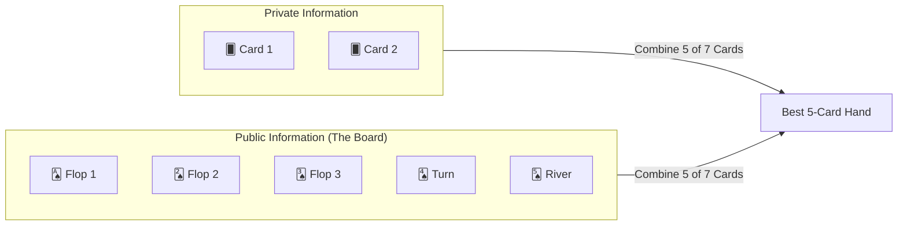
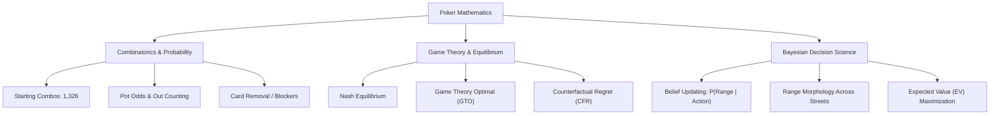
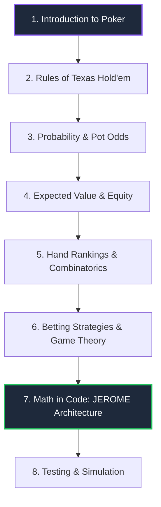

# ♠️ Introduction to Poker: Where Math Meets the Felt

> *"Real life is not like that. Real life consists of bluffing, of little tactics of deception, of asking yourself what is the other man going to think I mean to do. And that is what games are about in my theory."*  
> — **John von Neumann**, Father of Modern Game Theory and Pioneer of Computing

Welcome to **Jesus, Math & Poker** — a developer-focused guide to the mathematical machinery behind computational poker.

If you are a programmer who has never played a hand of cards, or if you know the basic rules but always viewed poker as a smoky backroom game of gut hunches and Hollywood tells, prepare to look through a different lens. 

In modern computer science and applied mathematics, poker is recognized as one of the most fascinating challenges in decision theory: **a game of imperfect information, adversarial reasoning, and stochastic outcomes**. Every card dealt is a combinatoric event; every bet placed is an exercise in Bayesian inference; and every optimal strategy is a convergence toward Nash equilibrium.

This guide accompanies [**JEROME**](https://github.com/ChinnaphatLoha/JEROME) (**J**udgement **E**ngine for **R**ange, **O**dds, **M**oves & **E**quity), an open-source, deterministic No-Limit Texas Hold'em decision engine built from the ground up in Rust.

---

## 🤠 The Chris "Jesus" Ferguson Approach

In the year 2000, a quiet computer scientist with waist-length hair, a full beard, dark sunglasses, and a wide-brimmed black cowboy hat sat at the final table of the World Series of Poker (WSOP) Main Event. His name was **Chris Ferguson**, affectionately dubbed **"Jesus"** by his peers.

Ferguson was not your typical card shark. He held a Ph.D. in Computer Science from UCLA, where his research focused on virtual network routing algorithms and game-theoretic models under internet pioneer Leonard Kleinrock. Ferguson understood something that conventional poker players of his era resisted:

:::info The Mathematical Revelation
Poker is not a battle of psychic reads, intimidation, or mystical intuition. **Poker is an applied branch of game theory, probability, and risk management.**
:::

Ferguson transformed his computer science background into tournament dominance. Instead of trying to guess whether an opponent was bluffing on a whim, he and his father (Dr. Thomas Ferguson, an accomplished mathematician and game theorist) modeled betting games mathematically:
- Formulating **unexploitable defensive frequencies** so opponents could never profitably bluff him.
- Calculating exact **pot odds** against opponent hand distributions.
- Applying strict **bankroll management formulas** (the Kelly Criterion and risk-of-ruin models) that enabled him to turn a $0 freeroll bankroll into over $10,000 purely through statistical edge.

Ferguson proved to the world that when pure mathematics confronts emotion and superstition over a statistically significant sample size, **mathematics wins every single time**.

---

## 📜 What is Poker?

At its core, **No-Limit Texas Hold'em** is a zero-sum card game played with a standard 52-card French deck. Each player receives two private cards (known as *hole cards*), and throughout four betting rounds (*Preflop, Flop, Turn, River*), five community cards are dealt face-up on the board (*the community board*). Every active player constructs the best possible five-card hand using any combination of their two private cards and the five community cards.



### Why Poker Captivates Computer Scientists

In 1997, IBM's Deep Blue defeated Garry Kasparov at chess. In 2016, Google DeepMind's AlphaGo defeated Lee Sedol at Go. Both chess and Go are **games of perfect information**:
- All players see the entire board state simultaneously.
- There are no hidden variables, dice rolls, or simultaneous secrets.
- In theory, with sufficient computing power, a minimax search tree can solve the state space exhaustively.

```
┌───────────────────────────────────────────────────────────┐
│ Chess / Go: Perfect Information                           │
│ Complete State S is known to all agents at all times.     │
│ [State S] ───► Full Visibility ───► Deterministic Search  │
└───────────────────────────────────────────────────────────┘

┌───────────────────────────────────────────────────────────┐
│ Poker: Imperfect Information + Stochastic Transitions     │
│ True State S = (Private Hands, Public Board, Hidden Beliefs)│
│ [Observed State] ───► Probabilistic Range Distribution    │
└───────────────────────────────────────────────────────────┘
```

Poker is radically different. It is a **game of imperfect information**:
1. **Hidden State**: You cannot see your opponents' hole cards. You only observe their public betting actions.
2. **Stochastic Elements**: The dealing of future cards is governed by probability distributions from the remaining deck.
3. **Deception as a Mathematical Necessity**: If you only bet when you hold the best hand, rational opponents will fold. If you always bluff, rational opponents will call you down. Therefore, **bluffing is not a psychological trick; it is a mathematical requirement for strategic equilibrium**.

---

## 🎯 Skill vs. Luck: The Math Perspective

One of the most persistent misconceptions among outsiders is that poker is gambling — indistinguishable from roulette, craps, or slot machines.

Let's dissect this using statistical theory.

### The Casino vs. The Poker Room

In casino games (such as roulette or blackjack), players wage against the "house." The casino designs the rules with an immutable negative expected value ($\mathbb{E}[X] < 0$) for the player. No amount of human skill or algorithmic sophistication can overcome the house edge in American roulette:

$$\mathbb{E}[\text{Roulette Spin}] = -\frac{2}{38} \approx -5.26\%$$

In poker, however:
- Players play **against each other**, not against the house.
- The house merely provides the table and dealer, collecting a tiny fixed commission (*the rake*).
- Because human beings exhibit systematic psychological biases, emotional tilting, and mathematical errors, a skilled player (or a rigorous engine) operates with a **positive expected value** ($\mathbb{E}[X] > 0$).

### Short-Term Variance vs. The Law of Large Numbers

In the short run — a single hand, a single hour, or a single tournament — **variance ($\sigma^2$) dominates**.

An amateur holding $7\spadesuit 2\diamondsuit$ (statistically the worst starting hand in Hold'em) can shove all-in against a grandmaster's $A\spadesuit A\heartsuit$. Roughly $12\%$ of the time, the board runs out to give the amateur a straight, two pair, or trips. The beginner wins the pot, and the grandmaster loses their stack.

Does this mean poker is luck?

Consider the **Strong Law of Large Numbers (SLLN)**. Let $X_1, X_2, \dots, X_n$ be independent, identically distributed random variables representing the payoff of each decision, with true expected value $\mu = \mathbb{E}[X]$ and finite variance $\sigma^2$:

$$P\left( \lim_{n \to \infty} \frac{1}{n} \sum_{i=1}^n X_i = \mu \right) = 1$$

Furthermore, the standard error of the sample mean drops inversely with the square root of the number of hands $n$:

$$\text{SE}(\bar{X}_n) = \frac{\sigma}{\sqrt{n}}$$

```
Profit / Return
   ▲
   │                              /  Long-term Trend: +EV (Skill)
   │               /\            /
   │  /\  /\      /  \  /\      /
   │ /  \/  \    /    \/  \    /
   │/        \  /          \  /
───┼──────────\/────────────\/────────────────────────────► Hands Played (n)
   │   Short term: High Variance (Luck)
   ▼
```

- **Over 10 hands**: Variance is king. Anyone can win.
- **Over 1,000 hands**: Strategic tendencies begin to materialize, but luck swings still sway the balance.
- **Over 100,000 hands**: Luck effectively normalizes. The standard error shrinks toward zero, and the win rate converges on pure mathematical edge.

:::tip The Mathematical Definition of Skill
A poker decision is "skilled" if and only if it maximizes Expected Value ($\mathbb{E}[\text{EV}]$) given the available information. The immediate outcome of the hand (win or lose) is irrelevant noise; the quality of the decision is absolute.
:::

---

## 📐 The Three Pillars of Poker Mathematics

How does an analytical mind approach poker? The game rests upon three interconnected mathematical disciplines:



### 1. Probability and Combinatorics

A standard 52-card deck yields:
- $\binom{52}{2} = \frac{52 \times 51}{2} = 1,326$ unique two-card starting hand combinations.
- Taking suit equivalence into account (e.g., $A\spadesuit K\spadesuit$ is strategically identical to $A\heartsuit K\heartsuit$ preflop), these condense into **169 distinct canonical hand types**:
  - 13 pocket pairs ($AA$ through $22$, 6 combos each = 78 combos)
  - 78 suited hands ($AKs$ through $32s$, 4 combos each = 312 combos)
  - 78 offsuit hands ($AKo$ through $32o$, 12 combos each = 936 combos)
  - Total: $78 + 312 + 936 = 1,326$ combos.

When assessing the board, there are:
$$\binom{50}{3} = 19,600 \text{ possible flops}$$
$$\binom{50}{5} = 2,118,760 \text{ possible 5-card complete runouts}$$

Combinatorics also gives rise to **card removal effects** (known as *blockers*). If you hold an Ace in your hand, you cut the number of remaining pocket Aces an opponent can possess from $\binom{4}{2} = 6$ down to $\binom{3}{2} = 3$ — an immediate $50\%$ reduction!

### 2. Game Theory and Equilibrium

In 1950, John Nash proved that every finite game with two or more players has an equilibrium point where no player can benefit by changing their strategy unilaterally.

In poker, this is known as **GTO (Game Theory Optimal)** play:
- An equilibrium strategy that is mathematically **unexploitable**.
- If you play a true GTO strategy, an opponent could literally look at your strategy charts and still cannot achieve a positive win-rate against you.
- Modern GTO solvers compute these strategies using **Counterfactual Regret Minimization (CFR)**, iteratively playing billions of simulated hands against themselves until regret converges to zero.

### 3. Bayesian Decision Science & Expected Value

You never put an opponent on one specific hand like "he has Ace-King." Rather, you model an opponent as a **probability distribution over the entire 1,326 combinatorial space**, called a **range**.

As the opponent takes actions (raising preflop, checking the flop, betting big on the turn), you apply **Bayes' Theorem**:

$$P(\text{Hand} \mid \text{Action}) = \frac{P(\text{Action} \mid \text{Hand}) \cdot P(\text{Hand})}{P(\text{Action})}$$

Hands that would not bet are pruned or down-weighted; hands that would bet are reinforced. With every street, their range morphs and narrows.

---

## ⚙️ What is JEROME?

[**JEROME**](https://github.com/ChinnaphatLoha/JEROME) stands for:

$$\textbf{J}\text{udgement } \textbf{E}\text{ngine for } \textbf{R}\text{ange, } \textbf{O}\text{dds, } \textbf{M}\text{oves \& } \textbf{E}\text{quity}$$

It is an open-source, production-grade, deterministic poker decision engine engineered in **Rust**.

### Why Pure Math? (No Black-Box AI)

Many modern systems attempt to solve complex games by training massive deep neural networks or reinforcement learning models. While effective in certain environments, deep learning brings major handicaps to poker engineering:
- **Opaque ("Black Box")**: A neural net cannot explain *why* it decided to raise $3.2\times$ pot on the river.
- **Non-deterministic & Hallucinatory**: Tiny floating-point shifts or unseen edge states can trigger bizarre blunders.
- **Resource Heavy**: Requires gigabytes of weights, tensor runtimes, and GPU acceleration.

**JEROME takes an unapologetically mathematical approach:**

:::note The JEROME Philosophy
Encode decades of rigorous poker mathematics and game theory into **deterministic, composable, high-performance computational pipelines**. Every recommendation produced by JEROME is accompanied by an exact mathematical justification: equity percentage, pot odds, fold equity estimate, and net Expected Value ($EV$).
:::

### High-Performance Rust Architecture

Poker decision spaces require evaluating millions of hand matchups in milliseconds. JEROME achieves this by leveraging Rust's zero-cost abstractions:
- **Bit-packed card representations** (a card fits inside an 8-bit integer; a hand fits in a 64-bit integer mask).
- **$O(1)$ Hand Evaluation**: Using constant-time perfect-hash table lookups, evaluating a 7-card hand takes under **36 nanoseconds**.
- **Monte Carlo & Exact Equity**: Multi-threaded parallel simulations measuring hand equity against arbitrary opponent ranges.
- **Zero Allocations in Hot Paths**: Deterministic memory layout enabling sub-10ms full-pipeline decisions.

Here is a glimpse of how JEROME evaluates a real poker spot in Rust:

```rust
use poker_engine::{PokerEngine, EngineConfig};
use poker_engine::core::card::{Card, Rank, Suit};
use poker_engine::core::game::{GameStateBuilder, Player, PlayerStatus, Street};
use poker_engine::core::Position;

fn main() -> Result<(), Box<dyn std::error::Error>> {
    // 1. Initialize the deterministic engine
    let engine = PokerEngine::new(EngineConfig::default());

    // 2. Define the game state on the Flop
    let state = GameStateBuilder::new()
        .street(Street::Flop)
        .hero_cards([
            Card::new(Rank::Ace, Suit::Spades),
            Card::new(Rank::King, Suit::Spades),
        ])
        .board(vec![
            Card::new(Rank::Queen, Suit::Spades),
            Card::new(Rank::Ten, Suit::Hearts),
            Card::new(Rank::Five, Suit::Diamonds),
        ])
        .pot(120)
        .current_bet(40)
        .big_blind(2)
        .add_player(Player {
            id: 0,
            position: Position::BTN,
            stack: 980,
            status: PlayerStatus::Active,
            bet_this_round: 0,
        })
        .add_player(Player {
            id: 1,
            position: Position::BB,
            stack: 960,
            status: PlayerStatus::Active,
            bet_this_round: 40,
        })
        .hero_index(0)
        .build()?;

    // 3. Compute optimal decision via pure mathematics
    let decision = engine.analyze(&state)?;

    println!("Recommended Action: {:?}", decision.recommended_action);
    println!("Calculated Equity:  {:.1}%", decision.estimated_equity * 100.0);
    println!("Expected Value:     {:.2} chips", decision.estimated_ev);
    println!("Explanation:        {}", decision.explanation);

    Ok(())
}
```

---

## 👥 Who This Guide is For

This documentation is tailored for curious, analytical minds:

| Audience | What You Will Gain |
|:---|:---|
| **Software Engineers & Developers** | Learn how to model complex domain rules, state machines, and high-speed simulation engines in typed languages like Rust. |
| **Math & Data Science Enthusiasts** | Discover how combinatorics, probability density, Bayesian range updates, and Nash equilibria operate in a live game engine. |
| **Poker Players & Enthusiasts** | Demystify solver outputs. Understand the exact equations behind equity calculators, pot odds, and GTO balance. |
| **Rustaceans** | Study an idiomatic, production-ready Rust workspace featuring multi-crate modularization, bitwise operations, and Criterion benchmarking. |

:::note No Prior Poker Knowledge Required
You do **not** need to know card terminology or how betting works before starting. We cover everything from the basic rules to advanced game-theoretic equations.
:::

---

## 🗺️ Roadmap: What This Guide Covers

The guide is divided into **8 structured modules**, taking you step-by-step from card basics to building a full decision engine:



### The 8 Sections

1. **[Introduction to Poker](/docs/intro)** *(You are here)*  
   The philosophy of poker mathematics, Chris Ferguson's story, skill versus variance, and the foundational vision behind the JEROME engine.

2. **[Rules of Texas Hold'em](/docs/rules)**  
   The mechanics of the game: blinds, positions (BTN, SB, BB, UTG, MP, CO), betting rounds (Preflop, Flop, Turn, River), valid player actions, and showdown rules.

3. **[Probability & Pot Odds](/docs/probability)**  
   Counting card "outs", the Rule of 2 and 4, calculating direct pot odds, implied odds, reverse implied odds, and determining your break-even calling threshold.

4. **[Expected Value & Equity](/docs/expected-value)**  
   The golden formula of poker ($\mathbb{E}[\text{EV}]$). Deconstructing fold equity, showdown equity, and how Monte Carlo simulations estimate win probabilities against arbitrary ranges.

5. **[Hand Rankings & Combinatorics](/docs/hand-rankings)**  
   The 10 standard hand rankings from High Card to Royal Flush. The combinatorics of the 1,326 starting hands, board textures (monotone, rainbow, paired), and blocker effects.

6. **[Betting Strategies & Game Theory](/docs/betting-strategies)**  
   Nash equilibrium, Game Theory Optimal (GTO) vs. exploitative strategy, minimum defense frequency (MDF), optimal bet sizing, and Stack-to-Pot Ratio (SPR).

7. **[Math in Code: The JEROME Architecture](/docs/math-in-code)**  
   A deep dive into how pure math becomes high-performance Rust: bitwise card representations, lookup tables, pipeline flow, and crate separation across the workspace.

8. **[Testing & Simulation](/docs/testing-simulation)**  
   Verifying mathematical correctness: unit testing equity calculations, edge-case validation, property-based testing, and Criterion benchmarking harness.

---

## 🚀 Let's Begin

Poker is not about gambling on the unknown. It is about **making optimal choices under uncertainty**. 

Turn the page, master the rules, and let's explore how mathematics conquers the game.

👉 **Next Up:** **[Rules of Texas Hold'em](/docs/rules)** — Master the table layout, positions, and flow of play.
