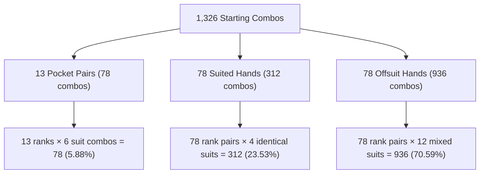
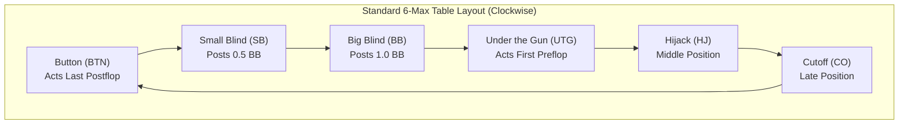
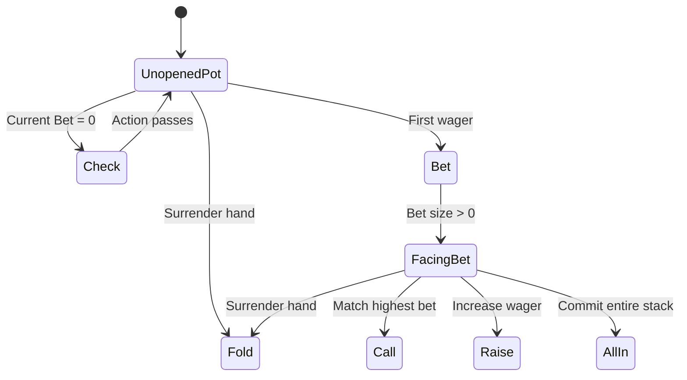

# Basic Poker Rules

Welcome to the fundamentals of **No-Limit Texas Hold'em (NLHE)**. Poker is often summarized by the famous adage:

> *"Texas Hold'em takes a minute to learn and a lifetime to master."*

From a software engineering and artificial intelligence perspective, No-Limit Texas Hold'em is an **imperfect-information, sequential, multi-agent game** played over a state space with stochastic card transitions. Before diving into game-tree search algorithms, Counterfactual Regret Minimization (CFR), or Monte Carlo equity evaluation, we need an exact, unambiguous model of how the game operates.

This guide covers the core rules of No-Limit Texas Hold'em and explains how each component maps cleanly into the data structures of the [JEROME](https://github.com/ChinnaphatLoha/JEROME) engine (`poker-core`).

---

## 1. The Deck: Discrete Combinatorics of 52 Cards

Texas Hold'em is played with a standard French-suited **52-card deck**. The deck contains no jokers and is partitioned along two orthogonal dimensions: **13 Ranks** and **4 Suits**.

### Suits and Ranks

| Property | Values | Mathematical Notation |
| :--- | :--- | :--- |
| **4 Suits** | Clubs ($\clubsuit$, `c`), Diamonds ($\diamondsuit$, `d`), Hearts ($\heartsuit$, `h`), Spades ($\spadesuit$, `s`) | $S = \{\clubsuit, \diamondsuit, \heartsuit, \spadesuit\}$ |
| **13 Ranks** | 2, 3, 4, 5, 6, 7, 8, 9, Ten (`T`), Jack (`J`), Queen (`Q`), King (`K`), Ace (`A`) | $R = \{2, 3, \dots, 9, \text{T}, \text{J}, \text{Q}, \text{K}, \text{A}\}$ |

Cards are ordered by rank:

$$
2 < 3 < 4 < 5 < 6 < 7 < 8 < 9 < \text{T} < \text{J} < \text{Q} < \text{K} < \text{A}
$$

:::info Suit Neutrality
In Texas Hold'em, **suits have zero intrinsic hierarchy**. Spades do not beat hearts; clubs do not beat diamonds. If two players end the hand with identical hand ranks (for instance, both holding an Ace-high flush with identical rank values), the pot is split equally ("chopped").
:::

### The Dual Role of the Ace

The Ace (`A`) is unique because it serves as:
1. **The highest card**: Participating in royal and broadway straights ($10\text{-}\text{J}\text{-}\text{Q}\text{-}\text{K}\text{-}\text{A}$).
2. **The lowest card**: Acting as rank 1 in the five-high straight ($A\text{-}2\text{-}3\text{-}4\text{-}5$), colloquially known as the **"Wheel"**.

### Combinatorics of Starting Hands

At the start of a hand, each player receives $2$ private cards from the $52$-card deck. The total number of unique two-card combinations is given by the binomial coefficient:

$$
\binom{52}{2} = \frac{52 \times 51}{2} = 1,326 \text{ starting hand combinations}
$$

Because suits are symmetric prior to any community cards appearing on the board, these $1,326$ combinations compress into **169 canonical strategically distinct starting hands**:



- **13 Pocket Pairs** ($AA, KK, \dots, 22$): Each pair has $\binom{4}{2} = 6$ combos $\implies 13 \times 6 = 78$ combos ($5.88\%$).
- **78 Suited Hands** ($AKs, AQs, \dots, 32s$): Two distinct ranks sharing the same suit. Each has $\binom{4}{1} = 4$ combos $\implies 78 \times 4 = 312$ combos ($23.53\%$).
- **78 Offsuit Hands** ($AKo, AQo, \dots, 32o$): Two distinct ranks with different suits. Each has $4 \times 3 = 12$ combos $\implies 78 \times 12 = 936$ combos ($70.59\%$).

---

## 2. Table Positions: The Power of Information

Table position is arguably the single most important strategic variable in poker. In imperfect-information game theory, **acting last confers an information advantage**: you observe all opponents' decisions before committing your own chips.

### The Dealer Button and Positional Categories

A marker known as the **Dealer Button** (abbreviated **BTN**) rotates clockwise by one seat after every hand. All positions are named relative to the button.



### Positional Hierarchy Table

The table below outlines positions for standard 6-max and full-ring (9-handed) tables:

| Position | Abbr. | Group | Preflop Order | Postflop Order | Strategic Characteristics |
| :--- | :--- | :--- | :--- | :--- | :--- |
| **Small Blind** | `SB` | Blinds | 8th (or 5th in 6-max) | **1st (Earliest)** | Forced bet ($0.5\text{ BB}$). Worst postflop position; plays entire hand out of position (OOP). |
| **Big Blind** | `BB` | Blinds | **Last preflop** | **2nd** | Forced bet ($1.0\text{ BB}$). Gets a discount to call preflop; acts second postflop. |
| **Under The Gun** | `UTG` | Early | **1st (Earliest)** | 3rd | First to act preflop. Must play tightest range due to maximum number of opponents behind. |
| **Under The Gun + 1** | `UTG1` | Early | 2nd | 4th | Present in 7+ handed tables. Early position discipline required. |
| **Middle Position** | `MP` | Middle | 3rd | 5th | Present in 8+ handed tables. Can open slightly wider than UTG. |
| **Hijack** | `HJ` | Middle | 4th (or 2nd in 6-max) | 6th (or 4th in 6-max) | Transition point from conservative early play to aggressive late-position stealing. |
| **Cutoff** | `CO` | Late | 5th (or 3rd in 6-max) | 7th (or 5th in 6-max) | Second best seat at the table. Prime position to steal blinds. |
| **The Button** | `BTN` | Late | 6th (or 4th in 6-max) | **Last (Latest)** | **Best seat at the table.** Has absolute position postflop on every street. |

:::tip In Position (IP) vs. Out of Position (OOP)
A player is **In Position (IP)** if they act after their opponent on all postflop streets. Being IP lets a player exert pressure, control pot size, and realize equity far more effectively than when **Out of Position (OOP)**.
:::

### The Heads-Up Exception (2 Players)
When only two players remain at the table, the rules invert slightly:
- The **Button (BTN)** posts the **Small Blind** and acts **first preflop**.
- Postflop, the BTN acts **last**, retaining positional advantage for the remainder of the hand.
- The Big Blind acts second preflop and first postflop.

---

## 3. The Flow of a Hand: Street by Street

A complete hand of Texas Hold'em progresses through four sequential betting rounds known as **streets**:

```mermaid
flowchart LR
    Blinds["Forced Blinds"] --> Deal["Preflop Deal<br/>(2 Hole Cards)"]
    Deal --> Preflop["Preflop Betting"]
    Preflop --> Flop["Flop Deal<br/>(3 Community Cards)"]
    Flop --> FlopBet["Flop Betting"]
    FlopBet --> Turn["Turn Deal<br/>(1 Community Card)"]
    Turn --> TurnBet["Turn Betting"]
    TurnBet --> River["River Deal<br/>(1 Community Card)"]
    River --> RiverBet["River Betting"]
    RiverBet --> Showdown["Showdown<br/>(Best 5 of 7)"]
```



### Step 1: Posting the Blinds
Before any cards are dealt, the two players seated directly to the left of the button must post mandatory wagers known as **blinds**:
- **Small Blind (SB)**: Typically posts $0.5$ Big Blinds ($0.5\text{ BB}$).
- **Big Blind (BB)**: Posts $1.0$ Big Blind ($1.0\text{ BB}$).

Blinds seed the pot with "dead money" ($1.5\text{ BB}$ total), ensuring there is an economic incentive for players to contest the pot rather than fold every hand.

### Step 2: Preflop
1. **The Deal**: Every player is dealt $2$ private cards face down (called **hole cards**).
2. **Action Order**: Action begins with the player directly to the left of the Big Blind (**Under the Gun / UTG**).
3. **Player Decisions**:
   - **Fold**: Surrender cards into the muck.
   - **Call**: Match the Big Blind amount ($1\text{ BB}$).
   - **Raise**: Increase the wager (minimum raise is $2\text{ BB}$).
4. The round proceeds clockwise until all active players have contributed equal amounts to the pot.
5. **The Big Blind Option**: If no player has raised by the time action reaches the Big Blind, the BB has the option to **check** (maintaining the current pot) or **raise**.

### Step 3: The Flop
1. The dealer deals **3 community cards** face up on the board.
2. All remaining players combine these 3 board cards with their 2 private hole cards.
3. **Action Order**: From the flop onward, action starts with the **first active player seated to the left of the Button** (typically SB or BB).
4. If no prior wager exists on this street, players may **check** (pass without wagering) or **bet**.

### Step 4: The Turn (Fourth Street)
1. The dealer deals **1 additional community card** face up (bringing the board to $4$ cards).
2. A third round of betting commences with identical mechanics to the flop.

### Step 5: The River (Fifth Street)
1. The dealer deals the **5th and final community card** face up (board total = $5$ cards).
2. A fourth and final round of betting takes place.

### Step 6: Showdown
If two or more players remain active after the river betting round concludes:
1. Players reveal their hole cards.
2. Each player constructs the **best possible 5-card poker hand** using any combination of their **2 hole cards** and the **5 community cards**.
3. A player may use:
   - Both hole cards + 3 board cards
   - One hole card + 4 board cards
   - Zero hole cards + all 5 board cards (*"playing the board"*)
4. The player with the highest-ranked 5-card hand wins the pot. If two or more players hold identical hand rankings, the pot is divided equally among them.

---

## 4. Betting Actions and State Transitions

At each decision node in the game tree, a player can select from up to six distinct actions depending on the current betting context.



### Action Definitions

1. **Fold**: Discard your hole cards and forfeit all claims to the pot. No further chips can be lost.
2. **Check**: Pass the action to the next player without adding chips to the pot. Only legal if the player has already matched the highest current bet on the street (or if no bet has been made).
3. **Call**: Match the current highest wager made during the active round.
4. **Bet**: Place the first wager of chips in a betting round where no preceding bet exists.
5. **Raise**: Increase the wager after another player has already bet.
6. **All-In**: Wager the entirety of your remaining chip stack.

### The Minimum Raise Rule

In No-Limit Hold'em, bet sizing is bounded by strict mathematical rules:

1. **Minimum Opening Bet**: Must be at least equal to $1\text{ Big Blind}$.
2. **Minimum Raise**: The increment of a raise must be **at least equal to the size of the previous bet or raise increment** in that round.

$$\Delta_{\text{raise}} \ge \Delta_{\text{previous}}$$

$$\text{Min Raise Total} = \text{Current Bet} + \max(\Delta_{\text{previous}}, \text{Big Blind})$$

#### Example Walkthrough:
- Big Blind is $\$10$.
- **Player A** opens with a raise to $\$30$ ($\Delta_1 = \$30 - \$10 = \$20$).
- **Player B** wants to re-raise (3-bet). The minimum raise increment is $\$20$.
- Player B's minimum allowable raise is:
  $$\$30 + \$20 = \$50$$
- If Player B raises to $\$80$ ($\Delta_2 = \$80 - \$30 = \$50$), then the subsequent player (Player C) must raise by at least $\$50$, making the minimum 4-bet equal to $\$80 + \$50 = \$130$.

### Table Stakes and Side Pots

Under the **Table Stakes** rule, a player cannot be forced out of a hand simply because they have fewer chips than an opponent's wager. If an opponent bets $\$500$ and you only have $\$150$, you can call **all-in** for your remaining $\$150$.

When players with disparate stacks go all-in, the engine splits the pot into a **Main Pot** and one or more **Side Pots**:

$$
\text{Main Pot} = N_{\text{eligible}} \times \text{Shortest Stack All-In}
$$

Any excess chips bet by players with deeper stacks form a **Side Pot**, for which only the remaining contenders with active stakes can compete.

#### Side Pot Calculation Example:
Consider three active players at showdown:

| Player | Chip Contribution | Stack State | Eligible Pots |
| :--- | :--- | :--- | :--- |
| **Alice** | $\$100$ | All-In | Main Pot only |
| **Bob** | $\$300$ | All-In | Main Pot + Side Pot 1 |
| **Charlie** | $\$300$ | Active (covers all) | Main Pot + Side Pot 1 |

- **Main Pot**: Alice's $\$100$ is matched by Bob ($\$100$) and Charlie ($\$100$):
  $$\text{Main Pot} = 3 \times \$100 = \$300$$
- **Side Pot 1**: Bob's remaining $\$200$ is matched by Charlie's remaining $\$200$:
  $$\text{Side Pot 1} = 2 \times \$200 = \$400$$
- **Resolution**:
  - If Alice has the best hand: Alice wins the **Main Pot** ($\$300$). The best hand between Bob and Charlie wins **Side Pot 1** ($\$400$).
  - If Bob has the best hand: Bob wins both the **Main Pot** and **Side Pot 1** (total $\$700$).

---

## 5. Betting Formats: No-Limit vs. Limit vs. Pot-Limit

While JEROME is specifically engineered for **No-Limit Texas Hold'em**, understanding alternative betting structures highlights why No-Limit requires specialized algorithmic design:

| Characteristic | No-Limit (NLHE) | Fixed Limit (LHE) | Pot-Limit (PLHE / PLO) |
| :--- | :--- | :--- | :--- |
| **Bet Size** | Any amount between min-bet and entire stack | Strictly fixed increments ($1\text{ SB}$ or $1\text{ BB}$) | Capped at the current size of the pot |
| **Max Raises** | Uncapped (players can re-raise until all-in) | Capped at 3 or 4 bets per street | Uncapped |
| **Action Space** | **Continuous** $[ \text{MinRaise}, \text{Stack} ]$ | **Discrete** $\{\text{Fold}, \text{Call}, \text{Raise}\}$ | **Bounded Continuous** $[ \text{MinRaise}, \text{Pot} ]$ |
| **Game-Tree Complexity** | Extreme ($\sim 10^{160}$ decision nodes) | Solved heads-up (Cepheus, 2015) | High |
| **Engine Focus** | **JEROME Core Domain** | Secondary / Legacy | Extensions possible |

:::note Why No-Limit is Computationally Hard
In Fixed Limit poker, the branching factor at each node is at most 3 (fold, call, raise). In No-Limit, a player with a $\$1,000$ stack in $\$1$ increments can theoretically choose from hundreds of distinct bet sizes. Modern solvers and engines like JEROME tame this complexity using **bet-sizing abstractions** and **dynamic game-tree clustering**.
:::

---

## 6. How Rules Map to JEROME's Architecture

The entire rule set discussed above is implemented with zero-cost abstractions in the [`poker-core`](https://github.com/ChinnaphatLoha/JEROME/tree/main/crates/poker-core) crate.

### 1. Streets as `Street`
Streets are represented by a lightweight 1-byte enum tracking card counts and state transitions:

```rust
// poker-core/src/game/street.rs
#[derive(Debug, Clone, Copy, PartialEq, Eq, PartialOrd, Ord, Hash)]
pub enum Street {
    Preflop,
    Flop,
    Turn,
    River,
}

impl Street {
    pub fn board_card_count(&self) -> usize {
        match self {
            Self::Preflop => 0,
            Self::Flop => 3,
            Self::Turn => 4,
            Self::River => 5,
        }
    }
}
```

### 2. Positions as `Position`
Table positions are explicitly typed, with helper classification methods used by preflop range tables:

```rust
// poker-core/src/game/position.rs
#[derive(Debug, Clone, Copy, PartialEq, Eq, Hash)]
pub enum Position {
    UTG,
    UTG1,
    MP,
    MP1,
    HJ,
    CO,
    BTN,
    SB,
    BB,
}

impl Position {
    pub fn is_early(&self) -> bool { matches!(self, Self::UTG | Self::UTG1) }
    pub fn is_late(&self) -> bool { matches!(self, Self::CO | Self::BTN) }
    pub fn is_blind(&self) -> bool { matches!(self, Self::SB | Self::BB) }
}
```

### 3. Action Types as `ActionType`
Betting options are encapsulated in an algebraic data type where wagers carry explicit chip amounts:

```rust
// poker-core/src/betting/action.rs
#[derive(Debug, Clone, Copy, PartialEq, Eq)]
pub enum ActionType {
    Fold,
    Check,
    Call,
    Bet(u64),
    Raise(u64),
    AllIn(u64),
}

impl ActionType {
    pub fn is_aggressive(&self) -> bool {
        matches!(self, Self::Bet(_) | Self::Raise(_) | Self::AllIn(_))
    }
}
```

### 4. Legal Action Generation in `betting_round.rs`
The engine computes valid transitions dynamically based on pot state, min-raise limits, and player stack sizes:

```rust
// poker-core/src/betting/betting_round.rs
pub fn legal_actions(state: &GameState) -> Vec<ActionType> {
    let hero = state.hero();
    let to_call = state.to_call();
    let stack = hero.stack;

    let mut actions = vec![ActionType::Fold];

    if to_call == 0 {
        actions.push(ActionType::Check);
        if stack > 0 {
            actions.push(ActionType::Bet(std::cmp::min(state.min_raise, stack)));
            actions.push(ActionType::AllIn(stack));
        }
    } else {
        if stack >= to_call {
            actions.push(ActionType::Call);
            let min_raise_total = state.current_bet + state.min_raise;
            let raise_amount_to_add = min_raise_total.saturating_sub(hero.bet_this_round);
            if stack > raise_amount_to_add {
                actions.push(ActionType::Raise(min_raise_total));
            }
        }
        if stack > 0 {
            actions.push(ActionType::AllIn(stack));
        }
    }

    actions
}
```

---

## Summary & What's Next

| Rule Concept | Mathematical / Algorithmic Meaning | JEROME Implementation |
| :--- | :--- | :--- |
| **52-Card Deck** | 1,326 combos, 169 canonical hands | `Card(u8)`, `Rank`, `Suit`, 64-bit masks |
| **Position** | Clockwise order; information asymmetry | `Position`, `positions_for_table_size` |
| **Streets** | Sequential stochastic card releases (0 $\to$ 3 $\to$ 4 $\to$ 5) | `Street`, `GameState::board` |
| **Betting Engine** | Zero-sum chip allocation with min-raise constraints | `ActionType`, `legal_actions`, `min_raise_size` |
| **Showdown** | Best $\binom{7}{5} = 21$ combination evaluation | `poker-core::evaluator` (Two-plus-Two / lookup table) |

Now that we have established the rules and discrete foundation of Texas Hold'em, the next chapter covers **Hand Rankings and Combinatorics** — exploring how 7-card hands are scored, evaluated at nanosecond speed in Rust, and categorized into mathematical hand classes.
