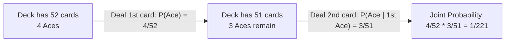
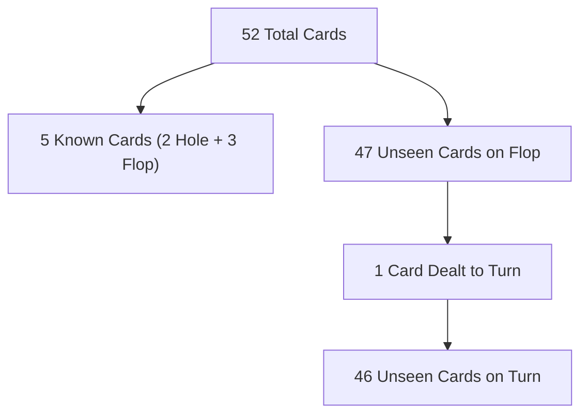
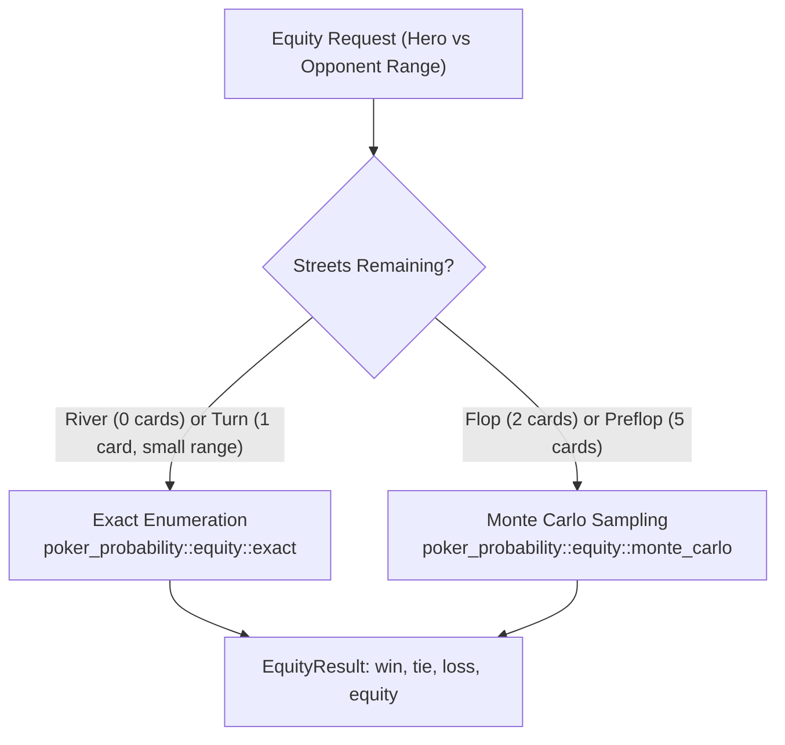

# 🎲 Probability Foundations

> *"In the long run, there is no luck in poker, but the short run is longer than most people realize."* — Rick Bennet

At the core of the [JEROME engine](https://github.com/ChinnaphatLoha/JEROME) is a strict foundational truth: **poker is an imperfect-information game governed entirely by probability and combinatorics**. 

Unlike chess, where every piece on the board is visible to both players, poker forces decision-making under uncertainty. Players hold private cards, community cards arrive sequentially from an unknown deck, and opponents take actions based on hidden intentions. Rather than relying on guesswork, heuristics, or opaque neural networks, JEROME models this uncertainty with mathematical rigor.

This chapter breaks down the probability theory required to build a poker engine: from Kolmogorov axioms to the combinatorial space of 1,326 starting hands, draw calculations, and the Monte Carlo sampling algorithms implemented in JEROME's `poker-probability` crate.

---

## 1. Basic Probability Theory Review

Before dealing cards, let us review the mathematical framework that underpins every calculation in a poker solver.

### Sample Spaces, Events, and Axioms

In probability theory, we model any random process using a **probability space** $(\Omega, \mathcal{F}, P)$:

1. **Sample Space ($\Omega$)**: The set of all possible atomic outcomes. For a single card dealt from a standard deck, $\Omega$ contains 52 individual cards:
   $$\Omega = \{2\clubsuit, 2\diamondsuit, 2\heartsuit, 2\spadesuit, \dots, \text{A}\spadesuit\}$$

2. **Event Space ($\mathcal{F}$)**: A collection of subsets of $\Omega$ representing events we might care about. For example, the event $E$ that the dealt card is an Ace:
   $$E = \{\text{A}\clubsuit, \text{A}\diamondsuit, \text{A}\heartsuit, \text{A}\spadesuit\} \subseteq \Omega$$

3. **Probability Measure ($P$)**: A function assigning a real number $P(E) \in [0, 1]$ to every event $E \in \mathcal{F}$, adhering to the **Kolmogorov Axioms**:
   - **Non-negativity**: $P(E) \ge 0$ for all $E \in \mathcal{F}$.
   - **Normalization**: $P(\Omega) = 1$ (the probability of *some* outcome occurring is $100\%$).
   - **Countable Additivity**: For any sequence of mutually exclusive (pairwise disjoint) events $E_1, E_2, E_3, \dots$ where $E_i \cap E_j = \emptyset$ for $i \ne j$:
     $$P\left(\bigcup_{i=1}^\infty E_i\right) = \sum_{i=1}^\infty P(E_i)$$

From these axioms, the essential property of **complementary probability** immediately follows:

$$P(E^c) = 1 - P(E)$$

:::tip Why Complementary Probability Matters
In poker, calculating the probability that an event *happens at least once* (e.g., hitting at least one flush card across two streets) is almost always easier to compute via the complement: $1 - P(\text{miss both})$.
:::

---

### Independent vs. Dependent Events

Two events $A$ and $B$ are **independent** if the occurrence of $A$ conveys zero information about the likelihood of $B$:

$$P(A \cap B) = P(A) \cdot P(B) \iff P(A \mid B) = P(A)$$

- **Example of Independence**: Consecutive coin flips, or spinning a roulette wheel twice. In online poker platforms, successive hands dealt after a fresh shuffle are independent.

However, **actions within a single hand of poker are strictly dependent events** because cards are sampled **without replacement**:

$$P(A \cap B) = P(A) \cdot P(B \mid A)$$



#### Practical Calculation: Dealing Pocket Aces ($AA$)
What is the probability that your two private hole cards are both Aces?
1. The first card dealt has 4 Aces among 52 cards:
   $$P(A_1) = \frac{4}{52} = \frac{1}{13}$$
2. The second card dealt is drawn from 51 remaining cards, with only 3 Aces left:
   $$P(A_2 \mid A_1) = \frac{3}{51} = \frac{1}{17}$$
3. Applying the multiplication rule for dependent events:
   $$P(A_1 \cap A_2) = P(A_1) \cdot P(A_2 \mid A_1) = \frac{4}{52} \times \frac{3}{51} = \frac{12}{2,652} = \frac{1}{221} \approx 0.004525 \text{ (0.452\%)}$$

Every card dealt to the board, shown by an opponent, or held in your hand permanently shifts the probability distribution of remaining cards.

---

### Conditional Probability and Bayes' Theorem

**Conditional probability** measures the probability of an event $A$ given that another event $B$ has already occurred:

$$P(A \mid B) = \frac{P(A \cap B)}{P(B)}, \quad \text{provided } P(B) > 0$$

Rearranging this formula yields **Bayes' Theorem**, the cornerstone of opponent modeling and range estimation:

$$P(A \mid B) = \frac{P(B \mid A) \cdot P(A)}{P(B)}$$

When partitioned over all possible mutually exclusive hypotheses $A_1, A_2, \dots, A_n$:

$$P(A_i \mid B) = \frac{P(B \mid A_i) \cdot P(A_i)}{\sum_{j=1}^n P(B \mid A_j) \cdot P(A_j)}$$

#### How JEROME Applies Bayes' Theorem to Ranges
When an opponent makes a move (such as a 3-bet before the flop), JEROME does not guess what single hand they hold. Instead, it uses Bayesian updating:

1. **Prior Distribution $P(A_i)$**: The baseline probability that the opponent plays combo $A_i$ from their current position.
2. **Likelihood $P(B \mid A_i)$**: The probability that the opponent would take action $B$ (e.g., 3-betting) given they hold combo $A_i$. A tight player might 3-bet $AA$ with $100\%$ frequency ($1.0$), but $7\heartsuit 2\diamondsuit$ with $0\%$ frequency ($0.0$).
3. **Marginal Likelihood $P(B)$**: The total probability of observing action $B$ across all possible hands in their range.
4. **Posterior Distribution $P(A_i \mid B)$**: The refined, updated probability that the opponent holds combo $A_i$ given their action.

:::info Bayesian Range Narrowing
Before action: An opponent holds any random two cards with uniform probability.  
After 3-betting: Low cards and uncoordinated offsuit combos drop to zero likelihood, while premium pairs and broadway cards comprise the majority of the posterior distribution.
:::

---

## 2. The Poker Deck as a Probability Space

A standard French-suited deck consists of:
- **13 Ranks**: $\mathcal{R} = \{2, 3, 4, 5, 6, 7, 8, 9, \text{T}, \text{J}, \text{Q}, \text{K}, \text{A}\}$
- **4 Suits**: $\mathcal{S} = \{\clubsuit, \diamondsuit, \heartsuit, \spadesuit\}$
- Total cards: $|\Omega| = 13 \times 4 = 52$.

### Hole Card Combinations: $\binom{52}{2} = 1,326$

In Texas Hold'em, each player receives 2 private cards. The order in which the dealer delivers these two cards does not affect hand evaluation (holding $A\spadesuit K\heartsuit$ is identical to holding $K\heartsuit A\spadesuit$).

Using the combinatorial formula for combinations without replacement:

$$\binom{n}{k} = \frac{n!}{k!(n - k)!}$$

Setting $n = 52$ and $k = 2$:

$$\binom{52}{2} = \frac{52!}{2!(52 - 2)!} = \frac{52 \times 51}{2 \times 1} = \frac{2,652}{2} = 1,326$$

There are **exactly 1,326 unique starting hand combinations** (often called *combos*) that can be dealt to any player.

---

### Why There Are Only 169 Strategically Distinct Starting Hands

While there are 1,326 physical combinations of cards, poker is **suit-invariant** before community cards are dealt. That is:
- $A\spadesuit K\spadesuit$ performs identically to $A\heartsuit K\heartsuit$, $A\diamondsuit K\diamondsuit$, or $A\clubsuit K\clubsuit$.
- $A\spadesuit K\heartsuit$ performs identically to $A\clubsuit K\diamondsuit$.

Because no suit has an inherent advantage over another in poker rules, starting hands collapse into **169 canonical hand classes**:

1. **Pocket Pairs ($XX$)**: Both cards share the same rank.
   - Number of ranks: $13$ (from $22$ up to $AA$).
2. **Suited Combinations ($XY\text{s}$)**: Two cards of different ranks sharing the same suit.
   - Distinct rank pairs: $\binom{13}{2} = \frac{13 \times 12}{2} = 78$.
3. **Offsuit Combinations ($XY\text{o}$)**: Two cards of different ranks with different suits.
   - Distinct rank pairs: $\binom{13}{2} = 78$.

$$\text{Total canonical hands} = 13 + 78 + 78 = 169$$

```
   ┌─────────────────────────────────────────────────────────────┐
   │ 13 Pocket Pairs + 78 Suited Hands + 78 Offsuit Hands = 169  │
   └─────────────────────────────────────────────────────────────┘
```

#### The Canonical $13 \times 13$ Starting Hand Grid

Poker players and solvers represent these 169 hands on a symmetric $13 \times 13$ matrix:
- **The Diagonal (13 cells)**: Pocket pairs ($AA, KK, \dots, 22$).
- **The Upper Right Triangle (78 cells)**: Suited hands ($AK\text{s}, AQ\text{s}, \dots$).
- **The Lower Left Triangle (78 cells)**: Offsuit hands ($AK\text{o}, AQ\text{o}, \dots$).

```text
       A      K      Q      J      T      9      8      7      6      5      4      3      2
   ┌──────┬──────┬──────┬──────┬──────┬──────┬──────┬──────┬──────┬──────┬──────┬──────┬──────┐
 A │  AA  │  AKs │  AQs │  AJs │  ATs │  A9s │  A8s │  A7s │  A6s │  A5s │  A4s │  A3s │  A2s │
   ├──────┼──────┼──────┼──────┼──────┼──────┼──────┼──────┼──────┼──────┼──────┼──────┼──────┤
 K │  AKo │  KK  │  KQs │  KJs │  KTs │  K9s │  K8s │  K7s │  K6s │  K5s │  K4s │  K3s │  K2s │
   ├──────┼──────┼──────┼──────┼──────┼──────┼──────┼──────┼──────┼──────┼──────┼──────┼──────┤
 Q │  AQo │  KQo │  QQ  │  QJs │  QTs │  Q9s │  Q8s │  Q7s │  Q6s │  Q5s │  Q4s │  Q3s │  Q2s │
   ├──────┼──────┼──────┼──────┼──────┼──────┼──────┼──────┼──────┼──────┼──────┼──────┼──────┤
 J │  AJo │  KJo │  QJo │  JJ  │  JTs │  J9s │  J8s │  J7s │  J6s │  J5s │  J4s │  J3s │  J2s │
   ├──────┼──────┼──────┼──────┼──────┼──────┼──────┼──────┼──────┼──────┼──────┼──────┼──────┤
 T │  ATo │  KTo │  QTo │  JTo │  TT  │  T9s │  T8s │  T7s │  T6s │  T5s │  T4s │  T3s │  T2s │
   └──────┴──────┴──────┴──────┴──────┴──────┴──────┴──────┴──────┴──────┴──────┴──────┴──────┘
   (Upper triangle = Suited 's' | Diagonal = Pairs | Lower triangle = Offsuit 'o')
```

---

## 3. Probability of Being Dealt Specific Hands

Although there are 169 canonical categories, **not all categories are equally likely**. Pocket pairs, suited hands, and offsuit hands have dramatically different combo counts.

### 1. Pocket Pairs: 6 Combos Each

For any given rank $R$, there are 4 cards of that rank in the deck (one for each suit). To form a pocket pair, we select 2 cards from those 4:

$$\binom{4}{2} = \frac{4 \times 3}{2} = 6 \text{ combinations}$$

For Pocket Aces ($AA$):
$$\{A\spadesuit A\heartsuit,\; A\spadesuit A\diamondsuit,\; A\spadesuit A\clubsuit,\; A\heartsuit A\diamondsuit,\; A\heartsuit A\clubsuit,\; A\diamondsuit A\clubsuit\}$$

- **Probability of a specific pocket pair (e.g., $AA$)**:
  $$P(AA) = \frac{6}{1,326} = \frac{1}{221} \approx 0.004525 \text{ (0.452\%)}$$
  *Odds: 220 to 1 against.*

- **Probability of being dealt ANY pocket pair** (13 ranks $\times$ 6 combos = 78 combos):
  $$P(\text{Any Pair}) = \frac{78}{1,326} = \frac{1}{17} \approx 0.058824 \text{ (5.88\%)}$$
  *Odds: 16 to 1 against (roughly once every 17 deals).*

---

### 2. Suited Hands: 4 Combos Each

For two distinct ranks $R_1$ and $R_2$ (e.g., Ace and King), a suited hand requires both cards to belong to the same suit. Since there are 4 suits, we pick 1 suit from 4:

$$\binom{4}{1} = 4 \text{ combinations}$$

For Ace-King Suited ($AK\text{s}$):
$$\{A\spadesuit K\spadesuit,\; A\heartsuit K\heartsuit,\; A\diamondsuit K\diamondsuit,\; A\clubsuit K\clubsuit\}$$

- **Probability of a specific suited hand (e.g., $AK\text{s}$)**:
  $$P(AK\text{s}) = \frac{4}{1,326} = \frac{2}{663} \approx 0.003017 \text{ (0.302\%)}$$
  *Odds: 330.5 to 1 against.*

- **Probability of being dealt ANY suited hand** (78 rank pairs $\times$ 4 combos = 312 combos):
  $$P(\text{Any Suited Hand}) = \frac{312}{1,326} = \frac{52}{221} \approx 0.235294 \text{ (23.53\%)}$$
  *Roughly 1 in every 4.25 hands.*

---

### 3. Offsuit Hands: 12 Combos Each

For two distinct ranks $R_1$ and $R_2$, an offsuit hand requires the cards to have different suits.
- There are 4 choices for the suit of $R_1$.
- There are 3 remaining choices for the suit of $R_2$.

$$4 \times 3 = 12 \text{ combinations}$$

For Ace-King Offsuit ($AK\text{o}$):
$$\begin{matrix}
A\spadesuit K\heartsuit & A\spadesuit K\diamondsuit & A\spadesuit K\clubsuit \\
A\heartsuit K\spadesuit & A\heartsuit K\diamondsuit & A\heartsuit K\clubsuit \\
A\diamondsuit K\spadesuit & A\diamondsuit K\heartsuit & A\diamondsuit K\clubsuit \\
A\clubsuit K\spadesuit & A\clubsuit K\heartsuit & A\clubsuit K\diamondsuit
\end{matrix}$$

- **Probability of a specific offsuit hand (e.g., $AK\text{o}$)**:
  $$P(AK\text{o}) = \frac{12}{1,326} = \frac{2}{221} \approx 0.009050 \text{ (0.905\%)}$$
  *Odds: 109.5 to 1 against.*

- **Probability of being dealt ANY offsuit hand** (78 rank pairs $\times$ 12 combos = 936 combos):
  $$P(\text{Any Offsuit Hand}) = \frac{936}{1,326} = \frac{156}{221} \approx 0.705882 \text{ (70.59\%)}$$
  *Roughly 7 out of every 10 hands.*

---

### Preflop Combinatorial Summary

We can verify that our partitions account for the entire sample space:

$$\text{Total Combos} = (13 \times 6) + (78 \times 4) + (78 \times 12) = 78 + 312 + 936 = 1,326$$

| Hand Category | Canonical Hands | Combos per Hand | Total Combos | % of All Deals | Frequency Ratio |
| :--- | :---: | :---: | :---: | :---: | :---: |
| **Pocket Pairs** ($XX$) | 13 | 6 | 78 | **5.88%** | 1 per 17 hands |
| **Suited Hands** ($XY\text{s}$) | 78 | 4 | 312 | **23.53%** | 1 per 4.25 hands |
| **Offsuit Hands** ($XY\text{o}$) | 78 | 12 | 936 | **70.59%** | 1 per 1.42 hands |
| **Total** | **169** | — | **1,326** | **100.00%** | — |

:::note Critical Range Insight: The 3-to-1 Ratio
For any unpaired holding like Ace-King, there are **16 total combinations** (4 suited + 12 offsuit). Offsuit combos outnumber suited combos by exactly $3 : 1$. 

When an opponent's range includes broadway cards, the unsuited variations will comprise the vast majority of their holdings unless their range has been heavily filtered by prior actions.
:::

---

## 4. Probability of Hitting Draws

Once the flop is dealt, players evaluate their holdings against the board. Often a player does not hold a made hand yet, but rather a **draw** — an incomplete hand that needs one or more specific cards to complete a straight, flush, or better.

The cards remaining in the deck that improve our hand to a likely winner are called **outs**.

### The Unknown Card Pool
- Total cards in deck: $52$
- Cards known on the flop: 2 (hero hole cards) + 3 (flop cards) = $5$ cards
- **Unseen cards on the Flop**: $52 - 5 = 47$ cards
- **Unseen cards on the Turn**: $52 - 6 = 46$ cards



---

### Flush Draws

Suppose Hero holds $A\heartsuit 4\heartsuit$ and the flop is $K\heartsuit 9\heartsuit 2\spadesuit$. Hero has 4 hearts.

There are 13 total hearts in the deck. We see 4 hearts (2 in hand, 2 on board), leaving:
$$\text{Outs} = 13 - 4 = 9 \text{ hearts}$$

#### 1. Probability of hitting on the Turn
There are 9 favorable cards among 47 unseen cards:

$$P(\text{Flush on Turn}) = \frac{9}{47} \approx 0.191489 \text{ (19.15\%)}$$

#### 2. Probability of hitting on the River (given a miss on the Turn)
If the turn is a non-heart, 46 unseen cards remain, with 9 hearts still in the deck:

$$P(\text{Flush on River} \mid \text{Miss Turn}) = \frac{9}{46} \approx 0.195652 \text{ (19.57\%)}$$

#### 3. Probability of hitting by the River (from the Flop)
To calculate the probability of hitting on *either* the turn or the river, we compute the complement (missing both streets):

$$P(\text{Miss Turn}) = \frac{47 - 9}{47} = \frac{38}{47} \approx 0.808511$$

$$P(\text{Miss River} \mid \text{Miss Turn}) = \frac{46 - 9}{46} = \frac{37}{46} \approx 0.804348$$

$$P(\text{Miss Both}) = \frac{38}{47} \times \frac{37}{46} = \frac{1,406}{2,162} \approx 0.650324$$

$$P(\text{Flush by River}) = 1 - P(\text{Miss Both}) = 1 - 0.650324 = 0.349676 \text{ (34.97\%)}$$

Hero will make their flush by the river roughly **$35\%$ of the time** (approximately 1 out of 3 times).

---

### Straight Draws

#### Open-Ended Straight Draw (OESD)
Hero holds $9\spadesuit 8\heartsuit$ on a board of $7\diamondsuit 6\clubsuit 2\spadesuit$. Any 5 or Ten completes the straight.
- 4 Fives + 4 Tens = **8 Outs**.

$$P(\text{OESD on Turn}) = \frac{8}{47} \approx 17.02\%$$

$$P(\text{OESD by River}) = 1 - \left(\frac{47 - 8}{47} \times \frac{46 - 8}{46}\right) = 1 - \left(\frac{39}{47} \times \frac{38}{46}\right) = 1 - \frac{1,482}{2,162} \approx 31.45\%$$

#### Inside Straight Draw (Gutshot)
Hero holds $9\spadesuit 8\heartsuit$ on a board of $K\diamondsuit 6\clubsuit 5\spadesuit$. Only a 7 completes the straight.
- 4 Sevens = **4 Outs**.

$$P(\text{Gutshot on Turn}) = \frac{4}{47} \approx 8.51\%$$

$$P(\text{Gutshot by River}) = 1 - \left(\frac{43}{47} \times \frac{42}{46}\right) = 1 - \frac{1,806}{2,162} \approx 16.47\%$$

#### Monster Combo Draw (Flush Draw + OESD)
Hero holds $9\heartsuit 8\heartsuit$ on a board of $7\heartsuit 6\heartsuit 2\clubsuit$.
- 9 hearts for the flush + 8 straight cards - 2 hearts already counted ($5\heartsuit, \text{T}\heartsuit$) = **15 Outs**.

$$P(\text{Combo Draw on Turn}) = \frac{15}{47} \approx 31.91\%$$

$$P(\text{Combo Draw by River}) = 1 - \left(\frac{32}{47} \times \frac{31}{46}\right) = 1 - \frac{992}{2,162} \approx 54.12\%$$

:::tip Monster Draws Are Favorites
With 15 outs on the flop, a drawing hand hits by the river over **$54\%$ of the time**. Against top pair, a 15-out draw is actually a statistical favorite!
:::

---

### The Rule of 2 and 4

In live poker, calculating exact fractional multiplications like $\frac{38}{47} \times \frac{37}{46}$ in real-time is impractical. Players use an extraordinarily accurate mental shortcut known as **The Rule of 2 and 4**:

$$\begin{aligned}
\text{Equity with 1 card to come (Turn } \rightarrow \text{ River)} &\approx \text{Outs} \times 2\% \\
\text{Equity with 2 cards to come (Flop } \rightarrow \text{ River)} &\approx \text{Outs} \times 4\%
\end{aligned}$$

#### Mathematical Derivation of the Rule

Why does this heuristic work?

1. **One Card to Come (Turn to River)**:
   There are 46 unseen cards. Each out contributes:
   $$\frac{1}{46} \approx 0.02174 \approx 2.17\%$$
   Approximating $\frac{1}{46}$ as $2\%$ yields a slight underestimate, but is accurate to within $1-2\%$ for typical outs.

2. **Two Cards to Come (Flop to River)**:
   Using the exact formula:
   $$P(\text{Hit}) = 1 - \left(1 - \frac{k}{47}\right)\left(1 - \frac{k}{46}\right) = k \left(\frac{1}{47} + \frac{1}{46}\right) - \frac{k^2}{47 \times 46}$$
   Notice that:
   $$\frac{1}{47} + \frac{1}{46} = \frac{93}{2,162} \approx 0.043016 \approx 4.3\%$$
   For small $k$, the quadratic term $\frac{k^2}{2,162}$ offsets the $+0.3\%$ difference, keeping $k \times 4\%$ exceptionally close to the exact probability!

#### Accuracy Comparison Table

| Draw Description | Outs ($k$) | Exact (Turn $\rightarrow$ River) | Rule of 2 | Exact (Flop $\rightarrow$ River) | Rule of 4 | Discrepancy (Flop) |
| :--- | :---: | :---: | :---: | :---: | :---: | :---: |
| **Gutshot** | 4 | 8.70% | 8.00% | 16.47% | 16.00% | -0.47% |
| **One Overcard** | 3 | 6.52% | 6.00% | 12.49% | 12.00% | -0.49% |
| **Two Overcards** | 6 | 13.04% | 12.00% | 24.14% | 24.00% | -0.14% |
| **OESD** | 8 | 17.39% | 16.00% | 31.45% | 32.00% | +0.55% |
| **Flush Draw** | 9 | 19.57% | 18.00% | 34.97% | 36.00% | +1.03% |
| **Gutshot + Flush** | 12 | 26.09% | 24.00% | 44.96% | 48.00% | +3.04% |
| **OESD + Flush** | 15 | 32.61% | 30.00% | 54.12% | 60.00% | +5.88% |

:::caution Large Outs Adjustment
When outs exceed 8 (such as combo draws), the Rule of 4 begins to overestimate due to the quadratic subtraction term $\frac{k^2}{2,162}$. 

A simple refinement used by advanced players is:
$$\text{Adjusted Equity} = (\text{Outs} \times 4) - (\text{Outs} - 8)\%$$
For a 15-out draw: $(15 \times 4) - (15 - 8) = 60 - 7 = 53\%$, matching the exact $54.12\%$ within $1\%$.
:::

---

## 5. How JEROME Uses Probability

The JEROME engine organizes its probability logic within the `poker-probability` crate, split into two primary paradigms:
1. **Rule of 2/4 Fast Estimator** (`poker_probability::odds::outs`)
2. **Exact & Monte Carlo Equity Engines** (`poker_probability::equity`)

```
JEROME Architecture
└── crates/
    ├── poker-core/          --> Card representation, Bitmask Deck
    ├── poker-analysis/      --> Hand evaluation, Draw detection
    └── poker-probability/   --> OutsCalculator, Exact & MC Equity
```

---

### 1. Fast Out Calculation in `poker-probability`

JEROME uses the `DrawInfo` struct from `poker-analysis` to detect draw types and immediately estimate equity using the Rule of 2 and 4:

```rust
// File: crates/poker-probability/src/odds/outs.rs
use poker_analysis::hand::draw::DrawInfo;

pub struct OutsCalculator;

impl OutsCalculator {
    pub fn count_outs(draw_info: &DrawInfo) -> u8 {
        let mut outs = 0;

        // Disjoint outs calculation
        if draw_info.is_flush_draw && draw_info.is_oesd {
            outs = 15;
        } else if draw_info.is_flush_draw && draw_info.is_gutshot {
            outs = 12;
        } else if draw_info.is_flush_draw {
            outs = 9;
        } else if draw_info.is_oesd {
            outs = 8;
        } else if draw_info.is_gutshot {
            outs = 4;
        }

        // Add 3 outs per overcard (discounted for non-nut outs)
        outs += draw_info.overcards * 3;

        // Cap outs at 21 to prevent skewed heuristic projections
        if outs > 21 { 21 } else { outs }
    }

    pub fn equity_from_outs(outs: u8, streets_remaining: u8) -> f64 {
        let outs_f = outs as f64;
        let p = match streets_remaining {
            1 => outs_f * 2.0 / 100.0, // Rule of 2
            2 => outs_f * 4.0 / 100.0, // Rule of 4
            _ => 0.0,
        };
        p.clamp(0.0, 1.0)
    }
}
```

This fast calculation enables pruning non-viable actions in search trees before triggering expensive simulations.

---

### 2. Equity Calculation Concepts

**Equity** is a player's mathematical expected share of the pot at showdown, assuming no further betting occurs:

$$\text{Equity} = P(\text{Win}) + \frac{1}{2} P(\text{Tie})$$

In a heads-up situation:
- If you win $60\%$ of runouts and tie $10\%$, your equity is:
  $$\text{Equity} = 0.60 + \frac{0.10}{2} = 0.65 \text{ (65\%)}$$

In multiway pots with $n$ tied players, tie equity divides equally: $\frac{1}{n} P(\text{Tie})$.

---

### 3. Exact vs. Monte Carlo Simulation

JEROME provides two distinct equity calculators in `crates/poker-probability/src/equity/`:



#### The Combinatorial Explosion
Why not always calculate exact equity?
- On the **River**, 0 community cards remain. We only enumerate the opponent's combos ($< 1,326$). Exact calculation takes under $10$ microseconds.
- On the **Turn**, 1 card remains ($44-46$ cards). For an opponent range of 200 combos: $200 \times 44 = 8,800$ hand evaluations. Highly feasible!
- On the **Flop**, 2 cards remain: $\binom{45}{2} = 990$ board runouts. For 500 combos: $500 \times 990 = 495,000$ evaluations.
- **Preflop**, 5 cards remain: $\binom{48}{5} = 1,712,304$ board runouts. For a full range:
  $$1,326 \times 1,712,304 \approx 2.27 \times 10^9 \text{ evaluations!}$$

Preflop and multiway flop situations require **Monte Carlo sampling**.

#### Monte Carlo Simulation in Action

JEROME's Monte Carlo implementation samples opponent hands proportionally to range weights, generates random board runouts using a high-performance pseudo-random number generator (`SmallRng`), and computes the convergence:

```rust
// File: crates/poker-probability/src/equity/monte_carlo.rs (simplified excerpt)
pub fn calculate_mc_equity(
    hero: [Card; 2],
    opp_range: &Range,
    board: &[Card],
    dead: &Deck,
    config: &EquityConfig,
) -> Result<EquityResult, PokerError> {
    let mut rng = match config.seed {
        Some(s) => SmallRng::seed_from_u64(s),
        None => SmallRng::from_entropy(),
    };

    let mut total_win = 0.0;
    let mut total_tie = 0.0;
    let mut total_loss = 0.0;
    let mut total_samples = 0;

    // Build dead deck including Hero's cards and the board
    let mut dead_deck = *dead;
    dead_deck.add(hero[0]);
    dead_deck.add(hero[1]);
    for &c in board { dead_deck.add(c); }

    // Filter valid combos from opponent range (card removal)
    let valid_combos: Vec<_> = opp_range.combos().iter()
        .filter(|c| !dead_deck.contains(c.cards[0]) && !dead_deck.contains(c.cards[1]))
        .collect();

    // Sampling loop
    for _ in 0..config.mc_samples {
        // 1. Sample opponent combo weighted by range weight
        let selected_combo = sample_weighted(&valid_combos, &mut rng);

        // 2. Remove opponent cards and sample remaining runout
        let mut available = Deck::full();
        available.remove_all_dead(&dead_deck);
        available.remove_card(selected_combo.cards[0]);
        available.remove_card(selected_combo.cards[1]);

        let needed = 5 - board.len();
        let runout = available.sample_n(needed, &mut rng);

        // 3. Evaluate hands
        let hero_rank = evaluate(&[&hero[..], board, &runout].concat())?;
        let opp_rank = evaluate(&[&selected_combo.cards[..], board, &runout].concat())?;

        match hero_rank.cmp(&opp_rank) {
            Ordering::Greater => total_win += 1.0,
            Ordering::Equal   => total_tie += 1.0,
            Ordering::Less    => total_loss += 1.0,
        }
        total_samples += 1;
    }

    Ok(EquityResult {
        win: total_win / total_samples as f64,
        tie: total_tie / total_samples as f64,
        loss: total_loss / total_samples as f64,
        equity: (total_win + total_tie / 2.0) / total_samples as f64,
        samples: total_samples,
        method: "monte_carlo",
    })
}
```

#### Monte Carlo Convergence: Central Limit Theorem
By the **Law of Large Numbers (LLN)**, as the sample count $N \to \infty$, the sample mean converges to the true equity $\mu$. By the **Central Limit Theorem (CLT)**, the standard error $\text{SE}$ of our estimate is bounded by:

$$\text{SE} = \sqrt{\frac{p(1 - p)}{N}} \le \frac{0.5}{\sqrt{N}}$$

- With $N = 1,000$ iterations: $\text{SE} \le \frac{0.5}{\sqrt{1,000}} \approx \pm 1.58\%$
- With $N = 10,000$ iterations: $\text{SE} \le \frac{0.5}{\sqrt{10,000}} \approx \pm 0.50\%$
- With $N = 100,000$ iterations: $\text{SE} \le \frac{0.5}{\sqrt{100,000}} \approx \pm 0.16\%$

JEROME defaults to $N = 10,000$ for tactical evaluation, balancing sub-millisecond execution with sub-percentage error.

---

### 4. Card Removal Effects (Blockers)

A critical concept in poker engine design is **card removal** (commonly referred to as *blockers*).

Because cards are drawn without replacement, **the cards you hold directly alter the probability of your opponent holding specific hands**:

```rust
// In poker_core::card::Deck, card removal is a single bitwise operation:
pub fn remove_card(&mut self, card: Card) {
    self.0 &= !card.to_bit_mask();
}
```

#### Mathematical Example of Blockers
Suppose you hold the Ace of Spades ($A\spadesuit$). How does this single card impact the probability that your opponent holds Pocket Aces ($AA$) or Ace-King ($AK$)?

1. **Impact on Pocket Aces ($AA$)**:
   - Normally: 4 Aces in deck $\rightarrow \binom{4}{2} = 6$ combos.
   - When you hold $A\spadesuit$: Only 3 Aces remain ($A\heartsuit, A\diamondsuit, A\clubsuit$) $\rightarrow \binom{3}{2} = 3$ combos.
   - **The opponent is $50\%$ less likely to hold $AA$!**

2. **Impact on Ace-King ($AK$)**:
   - Normally: 4 Aces $\times$ 4 Kings = 16 combos.
   - When you hold $A\spadesuit$: 3 Aces $\times$ 4 Kings = 12 combos.
   - **The opponent is $25\%$ less likely to hold $AK$.**

```
Opponent AA combos without your blocker:  [ 6 combos ]
Opponent AA combos when you hold an Ace:  [ 3 combos ] (50% reduction!)
```

JEROME's solver automatically updates opponent combo weights when filtering ranges. When hero holds cards that block the villain's calling range or value range, the decision engine shifts recommendations accordingly.

*(We explore blockers and range reconstruction in depth in Chapter 5: Betting Strategies & Ranges).*

---

## Key Takeaways & Cheat Sheet

| Metric | Formula / Value | Practical Meaning |
| :--- | :--- | :--- |
| **Total Starting Hand Combos** | $\binom{52}{2} = 1,326$ | Complete preflop sample space |
| **Strategically Distinct Hands** | $13 \text{ pairs} + 78\text{s} + 78\text{o} = 169$ | Cells in the standard solver grid |
| **Probability of Any Pocket Pair** | $\frac{78}{1,326} \approx 5.88\%$ | Roughly once every 17 hands ($16 : 1$) |
| **Probability of Any Suited Hand** | $\frac{312}{1,326} \approx 23.53\%$ | Roughly 1 in 4.25 hands |
| **Probability of Any Offsuit Hand** | $\frac{936}{1,326} \approx 70.59\%$ | Roughly 7 in 10 hands |
| **Flush Draw (Turn)** | $\frac{9}{47} \approx 19.15\%$ | ~1 in 5 chance on next street |
| **Flush Draw (By River)** | $1 - (\frac{38}{47} \times \frac{37}{46}) \approx 34.97\%$ | ~1 in 3 chance from flop to river |
| **Open-Ended Straight Draw (By River)** | $1 - (\frac{39}{47} \times \frac{38}{46}) \approx 31.45\%$ | ~31.5% chance from flop to river |
| **The Rule of 2 (Turn $\rightarrow$ River)** | $\text{Equity} \approx \text{Outs} \times 2\%$ | Quick calculation for 1 street |
| **The Rule of 4 (Flop $\rightarrow$ River)** | $\text{Equity} \approx \text{Outs} \times 4\%$ | Quick calculation for 2 streets |
| **Monte Carlo Standard Error** | $\text{SE} \le \frac{0.5}{\sqrt{N}}$ | Bounds simulation accuracy |

---

## Next Steps

Now that we understand the probability space and how to calculate the likelihood of hitting cards, the next question is: **How do we make profitable decisions with these numbers?**

Proceed to **Chapter 4: Expected Value & Pot Odds** to learn how probability marries pot sizes to determine whether to fold, call, or raise.
