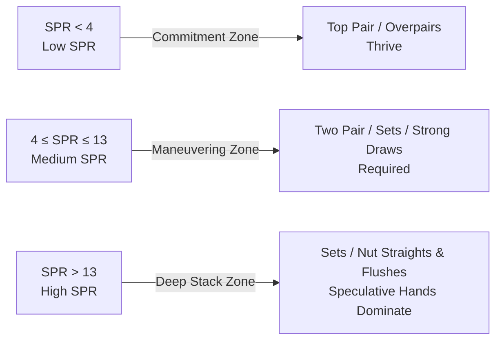
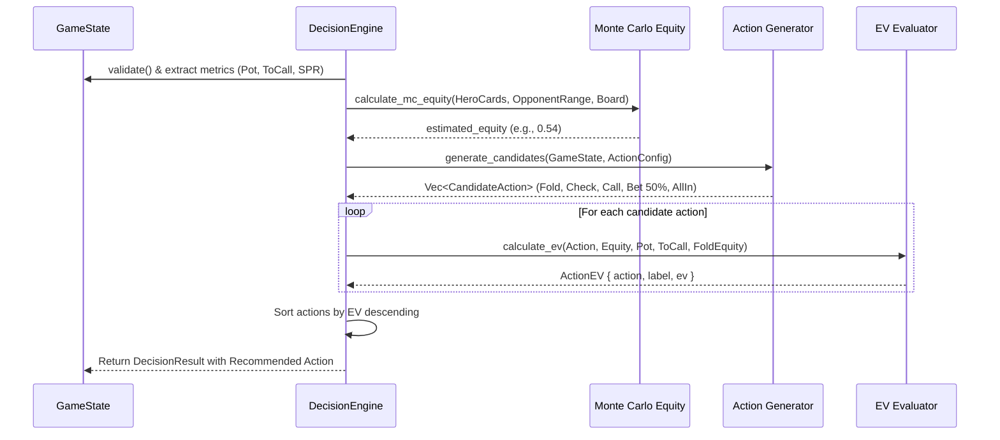

# Expected Value (EV)

In poker strategy and game engine architecture, **Expected Value (EV)** is the fundamental metric governing rational decision-making. Poker is a game of imperfect information and short-term variance: you can execute a theoretically flawed move and win chips, or execute a mathematically optimal play and lose your entire stack.

Chris "Jesus" Ferguson—the legendary poker champion with a Ph.D. in Computer Science who inspired the **JEROME** engine—built his game-theoretic foundation on one immutable principle:

> **Ignore short-term outcomes. Maximize Expected Value on every decision.**

This chapter explores the mathematical foundations of Expected Value, from fundamental formulas and pot odds to Stack-to-Pot Ratios (SPR), culminating in an inside look at how the `poker-decision` crate in **JEROME** evaluates candidate actions in real time.

---

## 1. What is Expected Value?

### Definition: Long-Run Average Outcome

In probability theory, the **Expected Value** ($\mathbb{E}[X]$ or simply $EV$) of a discrete random variable is the weighted average of all possible numerical outcomes, where each outcome is multiplied by the probability of its occurrence.

In poker, every action you take (folding, checking, calling, betting, or raising) branches into multiple potential terminal states (e.g., opponent folds, opponent calls and you win at showdown, opponent calls and you lose at showdown). $EV$ quantifies the net chip balance you will gain or lose on average if you were to make that exact decision under identical conditions infinitely many times.

### The EV Formula

The discrete expectation formula is expressed in LaTeX as:

$$
EV = \sum_{i=1}^{n} \Big( P(x_i) \times x_i \Big)
$$

Where:
- $n$ is the total number of distinct mutual outcomes.
- $P(x_i)$ is the probability of outcome $i$ occurring, such that $\sum_{i=1}^{n} P(x_i) = 1$.
- $x_i$ is the net payoff (gain or loss in chips/dollars) resulting from outcome $i$.

For a simple two-outcome bet (Win or Lose):

$$
EV = \big( P(\text{Win}) \times \text{Amount Won} \big) - \big( P(\text{Lose}) \times \text{Amount Lost} \big)
$$

### Why +EV Decisions Are the Ultimate Goal

Decisions fall into three categories:

| Decision Metric | Condition | Meaning |
| :--- | :--- | :--- |
| **$+EV$ (Positive EV)** | $EV > 0$ | Profitable in the long run. Adds chips to your expected bankroll. |
| **$0 EV$ (Neutral EV)** | $EV = 0$ | Break-even. Long-run chip count remains unchanged. |
| **$-EV$ (Negative EV)** | $EV < 0$ | Unprofitable in the long run. Leaks chips over time. |

By the **Law of Large Numbers**, as the sample size of hands $N$ approaches infinity, the empirical mean outcome converges almost surely to the mathematical expected value:

$$
\lim_{N \to \infty} \frac{1}{N} \sum_{k=1}^N X_k = \mathbb{E}[X]
$$

:::info Results-Oriented vs. Process-Oriented Thinking
A beginner thinks: *"I lost \$50 calling that draw, so calling was a mistake."*  
A quantitative developer knows: *"The call had an $EV$ of +\$14.80. Over 10,000 repetitions, that exact decision nets \$148,000. The single loss is merely statistical variance."*
:::

---

## 2. Pot Odds

Whenever an opponent bets, you face a financial proposition: risk a specific cost to contest an existing reward. **Pot Odds** express this relationship.

### Definition and Formula

Pot odds can be represented in two formats:
1. **Ratio format**: $\text{Pot} : \text{Cost to Call}$
2. **Percentage format (Required Equity)**: The minimum proportion of showdown equity required for a call to have an $EV \ge 0$.

Let:
- $\text{Pot}$ be the total size of the pot **after** the opponent has made their bet.
- $\text{ToCall}$ be the amount of chips required for Hero to match the bet.

The ratio of reward to risk is:

$$
\text{Pot Odds (Ratio)} = \frac{\text{Pot}}{\text{ToCall}} : 1
$$

The **Required Equity** ($\alpha$), often referred to in code as the required pot odds threshold, is:

$$
\alpha = \frac{\text{ToCall}}{\text{Pot} + \text{ToCall}}
$$

```
   Existing Pot ($100) + Opponent Bet ($50) = $150
┌────────────────────────────────────────────────────────┐
│                      Current Pot                       │
└────────────────────────────────────────────────────────┘
                           ▲
                           │  Hero risks $50
                           ▼
┌─────────────────────────┐
│       Hero's Call       │
└─────────────────────────┘
Total Final Pot = $150 + $50 = $200
Hero's Risk Fraction = $50 / $200 = 25.0%
```

### Pot Odds vs. Equity: The Calling Decision Rule

To determine if a call is profitable, compare your hand's actual showdown equity $E$ against the required threshold $\alpha$:

- If **$E > \alpha$**: The call is **$+EV$** $\rightarrow$ **Profitable Call**.
- If **$E = \alpha$**: The call is **$0 EV$** $\rightarrow$ **Break-even**.
- If **$E < \alpha$**: The call is **$-EV$** $\rightarrow$ **Unprofitable Call** (unless compensated by *Implied Odds*).

### Real Hand Scenarios

#### Scenario A: The Nut Flush Draw on the Turn

- **Game State**: Turn board is $9\spadesuit 4\spadesuit 2\heartsuit 7\diamondsuit$.
- **Hero**: Holds $A\spadesuit K\spadesuit$ (four to the nut flush).
- **Pot**: \$100 before the turn. Opponent bets \$50.
- **Current Pot**: $\text{Pot} = \$100 + \$50 = \$150$.
- **Cost to Call**: $\text{ToCall} = \$50$.

**Step 1: Calculate Pot Odds**

$$
\alpha = \frac{50}{150 + 50} = \frac{50}{200} = 0.25 \quad (25.0\%)
$$

Hero needs at least **$25.0\%$** equity to break even on an immediate call.

**Step 2: Calculate Hero's Equity**

There are 52 total cards in the deck. We know 6 cards (Hero's 2 hole cards + 4 board cards), leaving $52 - 6 = 46$ unseen cards. There are 13 spades in a deck; 4 are visible, leaving 9 remaining spades ("outs"):

$$
E = \frac{9}{46} \approx 0.1957 \quad (19.57\%)
$$

**Step 3: Compare**

$$
E = 19.57\% < \alpha = 25.0\%
$$

Because $E < \alpha$, an immediate call based solely on pot odds has a **negative EV**:

$$
\begin{aligned}
EV_{\text{call}} &= (E \times \text{Pot}) - ((1 - E) \times \text{ToCall}) \\
&= (0.1957 \times 150) - (0.8043 \times 50) \\
&= 29.355 - 40.215 = -\$10.86
\end{aligned}
$$

Calling without factoring in future bets will leak \$10.86 on average per hand.

---

#### Scenario B: The Monster Combo Draw on the Flop

- **Flop**: $8\spadesuit 7\spadesuit 2\diamondsuit$.
- **Hero**: $T\spadesuit 9\spadesuit$ (Open-Ended Straight Draw + Flush Draw).
- **Pot**: \$80. Opponent bets \$40.
- **Current Pot**: $\$80 + \$40 = \$120$.
- **Cost to Call**: \$40.

**Step 1: Calculate Required Equity**

$$
\alpha = \frac{40}{120 + 40} = \frac{40}{160} = 0.25 \quad (25.0\%)
$$

**Step 2: Calculate Hero's Outs and Equity**
- 9 flush outs (remaining spades).
- 6 straight outs (four non-spade Jacks and four non-spade 6s, excluding the $J\spadesuit$ and $6\spadesuit$ already counted).
- Total outs = $9 + 6 = 15$ outs out of 47 unseen cards.

Probability of hitting on either turn or river:

$$
E \approx 1 - \left(\frac{47 - 15}{47} \times \frac{46 - 15}{46}\right) = 1 - \left(\frac{32}{47} \times \frac{31}{46}\right) \approx 1 - 0.4588 = 54.12\%
$$

Even considering just the next card (turn):

$$
E_{\text{turn}} = \frac{15}{47} \approx 31.91\%
$$

**Step 3: Decision**

Since $31.91\% > 25.0\%$, calling is immediately **$+EV$** (and raising might yield an even higher $+EV$).

---

## 3. Implied Odds and Reverse Implied Odds

Pure pot odds assume no further betting takes place. In multi-street No-Limit Texas Hold'em, that assumption rarely holds.

### Implied Odds: Accounting for Future Streets

**Implied Odds** measure the additional chips you expect to extract from your opponent on future betting rounds when you hit your drawing hand.

If a call is $-EV$ strictly based on the current pot, future bets won when hitting your out can push the overall decision into $+EV$.

```
Current Pot ($150)  +  Hero Call ($50)  +  Future River Bets ($X)
─────────────────────────────────────────────────────────────────►
                       Total Payoff When Hit
```

#### Break-Even Formula for Implied Odds

To find how much extra money ($X$) you must win on subsequent streets to justify calling with insufficient immediate pot odds, set $EV = 0$:

$$
EV = E \times (\text{Pot} + \text{ToCall} + X) - \text{ToCall} = 0
$$

Solving for $X$:

$$
E \times (\text{Pot} + \text{ToCall} + X) = \text{ToCall}
$$

$$
\text{Pot} + \text{ToCall} + X = \frac{\text{ToCall}}{E}
$$

$$
X = \frac{\text{ToCall}}{E} - (\text{Pot} + \text{ToCall})
$$

#### Worked Example with Scenario A

Recalling Scenario A:
- $\text{Pot} = \$150$
- $\text{ToCall} = \$50$
- $E = 0.1957$ ($19.57\%$)

$$
X = \frac{50}{0.1957} - (150 + 50) = 255.49 - 200 = \$55.49
$$

:::tip Implied Odds Assessment
Hero needs to extract at least **\$55.50** from the opponent on the river when the flush hits to make the turn call profitable. If the opponent has \$150 behind and tends to pay off with top pair, calling the turn is comfortably $+EV$.
:::

### Reverse Implied Odds

While implied odds represent future gains, **Reverse Implied Odds** represent future losses. They occur when:
1. You make your target hand, but your opponent makes an even stronger hand.
2. You hit your hand, but opponents fold, yielding no future bets; while when you are beaten, you pay off large bets.

#### Classic Examples of Reverse Implied Odds
- **Dominated Flush Draws**: Holding $6\spadesuit 5\spadesuit$ on an $A\spadesuit 9\spadesuit 2\clubsuit$ board. If another spade hits, a higher flush holds you captive.
- **The "Dummy" End of a Straight**: Holding $T\heartsuit 9\heartsuit$ on a board of $J\clubsuit Q\diamondsuit K\spadesuit$. Any ten gives you a straight, but any Ace in an opponent's hand produces the Broadway nut straight.

:::caution Danger of Disregarding Reverse Implied Odds
When calculating $EV$ in poker engines, nominal card outs must be discounted if those cards complete stronger hands for an opponent's distribution.
:::

---

## 4. EV of Specific Actions

At any point during a hand, a player or engine chooses between distinct actions: **Fold**, **Check**, **Call**, or **Bet/Raise**.

### 1. EV of Folding

Folding forfeits all claim to the current pot:

$$
EV_{\text{fold}} = 0
$$

:::note The Sunk Cost Fallacy
Chips you previously put into the pot do **not** belong to you; they belong to the pot. When calculating the $EV$ of folding, your future chip change is exactly $0$. Never say *"Folding costs me \$20 because I already put in \$20."*
:::

### 2. EV of Calling

When calling, Hero risks $\text{ToCall}$ to win the current pot:

$$
EV_{\text{call}} = \Big( E \times \text{Pot} \Big) - \Big( (1 - E) \times \text{ToCall} \Big)
$$

Where:
- $\text{Pot}$ is the existing pot before Hero's call (including all bets and blinds).
- $\text{ToCall}$ is Hero's call amount.
- $E$ is Hero's equity against the villain's range ($0.0 \le E \le 1.0$).

Equivalently, factoring the total return:

$$
EV_{\text{call}} = E \times (\text{Pot} + \text{ToCall}) - \text{ToCall}
$$

Both algebraic representations are equivalent:

$$
E \cdot (\text{Pot} + \text{ToCall}) - \text{ToCall} = E \cdot \text{Pot} + E \cdot \text{ToCall} - \text{ToCall} = (E \cdot \text{Pot}) - ((1 - E) \cdot \text{ToCall})
$$

### 3. EV of Betting or Raising (Incorporating Fold Equity)

Betting or raising introduces **Fold Equity ($f$)**—the probability that opponents will fold to the wager, awarding Hero the pot without a showdown.

When Hero bets or raises an amount $A$:
- **Path 1: Opponent folds** (probability $f$). Hero wins the current pot ($\text{Pot}$).
- **Path 2: Opponent calls** (probability $1 - f$). Hero contests a new pot containing $(\text{Pot} + A)$ plus the opponent's match of $A$, with showdown equity $E$.

```
                                  ┌───────────────────────────┐
                                  │      Hero Bets / Raises   │
                                  └─────────────┬─────────────┘
                                                │
                       ┌────────────────────────┴────────────────────────┐
                       ▼                                                 ▼
             Opponent Folds (f)                               Opponent Calls (1 - f)
             Hero wins Pot                                    Hero goes to showdown
             Payoff = +Pot                                    Win (E): +(Pot + A)
                                                              Lose (1 - E): -A
```

Mathematically:

$$
EV_{\text{bet}} = EV_{\text{fold}} + EV_{\text{call\_received}}
$$

$$
EV_{\text{fold}} = f \times \text{Pot}
$$

$$
EV_{\text{call\_received}} = (1 - f) \times \Big[ \big( E \times (\text{Pot} + A) \big) - \big( (1 - E) \times A \big) \Big]
$$

Combining terms:

$$
EV_{\text{bet}} = f \cdot \text{Pot} + (1 - f) \cdot \Big[ E \cdot \text{Pot} - (1 - 2E) \cdot A \Big]
$$

#### The Semi-Bluffing Phenomenon
Notice what happens when $E = 0.35$ (weak equity) but $f = 0.40$ (opponent folds 40% of the time). Even though Hero would lose most showdowns, the combination of fold equity and showdown equity yields a strongly positive EV.

---

## 5. Stack-to-Pot Ratio (SPR)

Introduced by Ed Miller, Matt Flynn, and Sunny Mehta in *Professional No-Limit Hold'em*, the **Stack-to-Pot Ratio (SPR)** measures the depth of remaining stacks relative to the size of the pot on the flop.

### Definition and Formula

$$
SPR = \frac{\text{Effective Stack}}{\text{Pot}_{\text{flop}}}
$$

Where:
- $\text{Effective Stack} = \min(\text{Stack}_{\text{Hero}}, \text{Stack}_{\text{Villain}})$ is the maximum amount of chips that can be wagered between the two active players.
- $\text{Pot}_{\text{flop}}$ is the total pot on the flop immediately after pre-flop action concludes.

```
       Effective Stack ($800)
SPR = ───────────────────────── = 8.0
          Flop Pot ($100)
```

### The Three SPR Zones



| Zone | SPR Range | Typical Context | Strategic Implications |
| :--- | :--- | :--- | :--- |
| **Low SPR** | $< 4$ | 3-bet pots, short stacks | **High commitment**. Top pair top kicker (TPTK) and overpairs become auto-commit hands. Draws suffer from lack of implied odds. |
| **Medium SPR** | $4 - 13$ | Standard single-raised pots (SRP) | **Danger zone for one-pair hands**. Committing a full stack with one pair often loses to two pair or better. Sets and combo draws become premium holdings. |
| **High SPR** | $> 13$ | Deep stacks, limp pots, multi-way pots | **Implied odds paradise**. Small pocket pairs (set mining) and suited connectors thrive. One pair hands decline sharply in showdown value. |

### Strategic Decision Matrix by SPR

```
Hand Strength  │  Low SPR (< 4)      │  Medium SPR (4-13)   │  High SPR (> 13)
───────────────┼─────────────────────┼──────────────────────┼───────────────────────
Top Pair       │  Commit stack       │  Pot control / fold  │  Small pot only
Two Pair / Set │  Immense value      │  Commit stack        │  Play for stacks
Flush/Straight │  All-in ready       │  All-in ready        │  Beware cooler/nut req
Speculative    │  Unprofitable       │  Positional play     │  Massive implied odds
```

---

## 6. How JEROME Calculates EV

In the **JEROME** poker engine, decision-making is decoupled into specialized crates. EV calculation and candidate action ranking reside in [`poker-decision`](https://github.com/ChinnaphatLoha/JEROME/tree/main/crates/poker-decision).

### The `poker-decision` EV Pipeline

The decision process follows a 7-stage deterministic pipeline:



### 1. The Core Calculation Function

Here is the exact implementation from `JEROME/crates/poker-decision/src/ev.rs`:

```rust
use poker_core::ActionType;

/// Structure holding EV calculation for a specific action.
#[derive(Debug, Clone, PartialEq)]
pub struct ActionEV {
    pub action: ActionType,
    pub label: String,
    pub ev: f64,
}

/// Calculates Expected Value for a given action.
///
/// `equity`: Hero's equity (0.0 to 1.0)
/// `pot`: Current pot size
/// `to_call`: Amount hero needs to call (if any)
/// `fold_equity`: Estimated probability that opponent will fold (0.0 to 1.0)
pub fn calculate_ev(
    action: &ActionType,
    equity: f64,
    pot: u64,
    to_call: u64,
    fold_equity: f64,
) -> f64 {
    match action {
        ActionType::Fold => 0.0,
        ActionType::Check => equity * pot as f64,
        ActionType::Call => {
            let win_amount = pot as f64;
            let lose_amount = to_call as f64;
            (equity * win_amount) - ((1.0 - equity) * lose_amount)
        }
        ActionType::Bet(amount) | ActionType::Raise(amount) | ActionType::AllIn(amount) => {
            let amount = *amount as f64;
            // Fold EV: we win the current pot
            let fold_ev = fold_equity * pot as f64;

            // Call EV: we get called (1 - fold_equity)
            // We risk `amount`, and if we win, we win `pot + amount`
            let call_ev = (1.0 - fold_equity)
                * ((equity * (pot as f64 + amount)) - ((1.0 - equity) * amount));

            fold_ev + call_ev
        }
    }
}
```

### 2. Action Candidate Generation

In `JEROME/crates/poker-decision/src/actions.rs`, candidate actions are dynamically abstracted based on the current betting state and configuration:

```rust
pub fn generate_candidates(
    state: &GameState,
    config: &ActionAbstractionConfig,
) -> Vec<CandidateAction> {
    let mut candidates = Vec::new();
    let hero = state.hero();
    let stack = hero.stack;
    let to_call = state.to_call();
    let min_raise = state.min_raise;
    let current_bet = state.current_bet;
    let pot = state.pot;

    // 1. Fold is always valid when facing a bet
    if to_call > 0 {
        candidates.push(CandidateAction {
            action: ActionType::Fold,
            label: "Fold".to_string(),
        });
    }

    // 2. Check if no bet is required
    if to_call == 0 {
        candidates.push(CandidateAction {
            action: ActionType::Check,
            label: "Check".to_string(),
        });
    }

    // 3. Call if facing a bet
    if to_call > 0 && stack > 0 {
        candidates.push(CandidateAction {
            action: ActionType::Call,
            label: "Call".to_string(),
        });
    }

    // 4. Fractional pot bets (e.g. 33%, 50%, 75%, 100%)
    if to_call == 0 && stack > 0 {
        for &size in &config.bet_sizes {
            let mut bet_amount = (pot as f64 * size).round() as u64;
            bet_amount = bet_amount.max(min_raise);
            if bet_amount < stack {
                candidates.push(CandidateAction {
                    action: ActionType::Bet(bet_amount),
                    label: format!("Bet {:.0}% Pot", size * 100.0),
                });
            }
        }
    }

    // 5. Multipliers for raises (e.g. 2.5x, 3.0x)
    if to_call > 0 && stack > to_call {
        for &size in &config.raise_sizes {
            let raise_amount = (current_bet as f64 * size).round() as u64;
            let total_raise = raise_amount.max(current_bet + min_raise);
            if total_raise < stack + current_bet {
                candidates.push(CandidateAction {
                    action: ActionType::Raise(total_raise - current_bet),
                    label: format!("Raise {:.1}x", size),
                });
            }
        }
    }

    // 6. All-In option
    if stack > 0 {
        candidates.push(CandidateAction {
            action: ActionType::AllIn(stack),
            label: "All-In".to_string(),
        });
    }

    candidates
}
```

### 3. Fold Equity Modeling & Ranking

In `JEROME/crates/poker-decision/src/decision.rs`, the engine models fold equity as a function of the bet sizing relative to the pot, capping it at a conservative realistic threshold ($70\%$):

$$
f = \min\left( \frac{\text{amount}}{\text{pot} + \text{amount}}, 0.70 \right)
$$

The engine then executes the evaluation loop:

```rust
let mut action_evs: Vec<ActionEV> = candidates
    .into_iter()
    .map(|c| {
        let fold_equity = match &c.action {
            ActionType::Bet(amount)
            | ActionType::Raise(amount)
            | ActionType::AllIn(amount) => {
                let fe = (*amount as f64) / (pot as f64 + *amount as f64);
                fe.min(0.70)
            }
            _ => 0.0,
        };

        let ev = calculate_ev(&c.action, estimated_equity, pot, to_call, fold_equity);
        ActionEV {
            action: c.action,
            label: c.label,
            ev,
        }
    })
    .collect();

// Sort candidate actions by descending EV
action_evs.sort_by(|a, b| b.ev.partial_cmp(&a.ev).unwrap_or(std::cmp::Ordering::Equal));
```

### 4. A Live Engine Walkthrough

Consider an analysis executed by JEROME's `DecisionEngine`:
- **Board**: $K\spadesuit J\diamondsuit 4\clubsuit 2\heartsuit$ (Turn)
- **Hero**: $A\clubsuit K\diamondsuit$ (Top Pair, Top Kicker)
- **Pot**: 200 chips
- **To Call**: 50 chips (Opponent bet 50)
- **Monte Carlo Estimated Equity ($E$)**: $0.72$ ($72\%$)
- **Hero Stack**: 400 chips

The engine analyzes three alternatives:

#### Alternative 1: Fold
$$
EV_{\text{fold}} = 0.0
$$

#### Alternative 2: Call
- $\text{Pot} = 200$, $\text{ToCall} = 50$, $E = 0.72$
$$
EV_{\text{call}} = (0.72 \times 200) - ((1.0 - 0.72) \times 50) = 144 - 14 = +130.0
$$

#### Alternative 3: Raise to 150 (amount = 150)
- $f = \min\left(\frac{150}{200 + 150}, 0.70\right) = \frac{150}{350} \approx 0.4286$
- Fold EV: $0.4286 \times 200 = 85.72$
- Call EV:
  $$
  (1 - 0.4286) \times \Big[ (0.72 \times (200 + 150)) - ((1 - 0.72) \times 150) \Big]
  $$
  $$
  = 0.5714 \times \Big[ (0.72 \times 350) - (0.28 \times 150) \Big]
  $$
  $$
  = 0.5714 \times [252 - 42] = 0.5714 \times 210 = 120.0
  $$
- Total EV:
  $$
  EV_{\text{raise}} = 85.72 + 120.0 = +205.72
  $$

#### JEROME's Verdict:
1. **Raise 3.0x (150)**: $EV = +205.72$ ⭐ **Recommended Action**
2. **Call**: $EV = +130.00$
3. **Fold**: $EV = 0.00$

By systematically evaluating every branch through mathematical formulas, the engine removes guesswork, emotion, and bias—producing provably optimal plays across millions of simulated hands.

---

## Summary Cheat Sheet

| Metric | Formula | Goal |
| :--- | :--- | :--- |
| **Expected Value** | $EV = \sum P(x_i) \cdot x_i$ | Maximize across every decision node |
| **Pot Odds Threshold** | $\alpha = \frac{\text{ToCall}}{\text{Pot} + \text{ToCall}}$ | Compare against equity $E$; call if $E > \alpha$ |
| **Implied Odds Target** | $X = \frac{\text{ToCall}}{E} - (\text{Pot} + \text{ToCall})$ | Additional river chips needed to make draw profitable |
| **EV of Call** | $EV_{\text{call}} = (E \cdot \text{Pot}) - ((1 - E) \cdot \text{ToCall})$ | Must be $> 0$ and $> EV_{\text{fold}}$ |
| **EV of Bet/Raise** | $EV_{\text{bet}} = f \cdot \text{Pot} + (1 - f) \cdot [E(\text{Pot} + A) - (1-E)A]$ | Exploit both fold equity and showdown equity |
| **Stack-to-Pot Ratio** | $SPR = \frac{\text{Effective Stack}}{\text{Pot}_{\text{flop}}}$ | Low ($<4$), Medium ($4-13$), High ($>13$) determines hand commitment |
