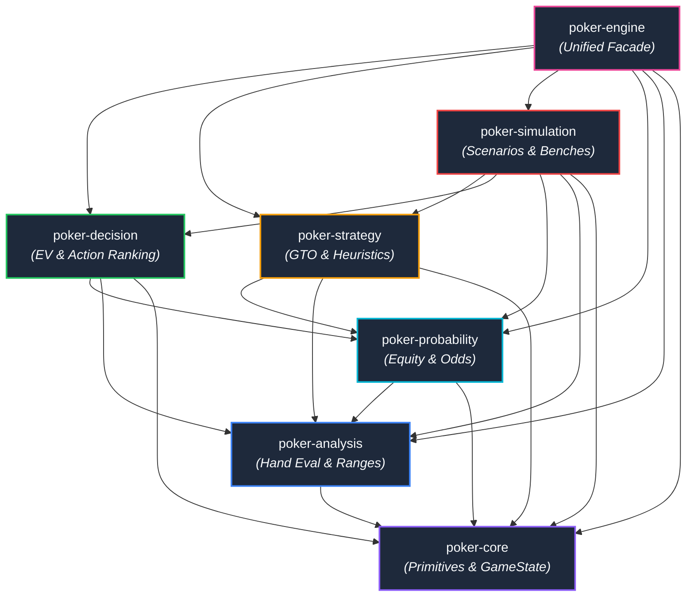
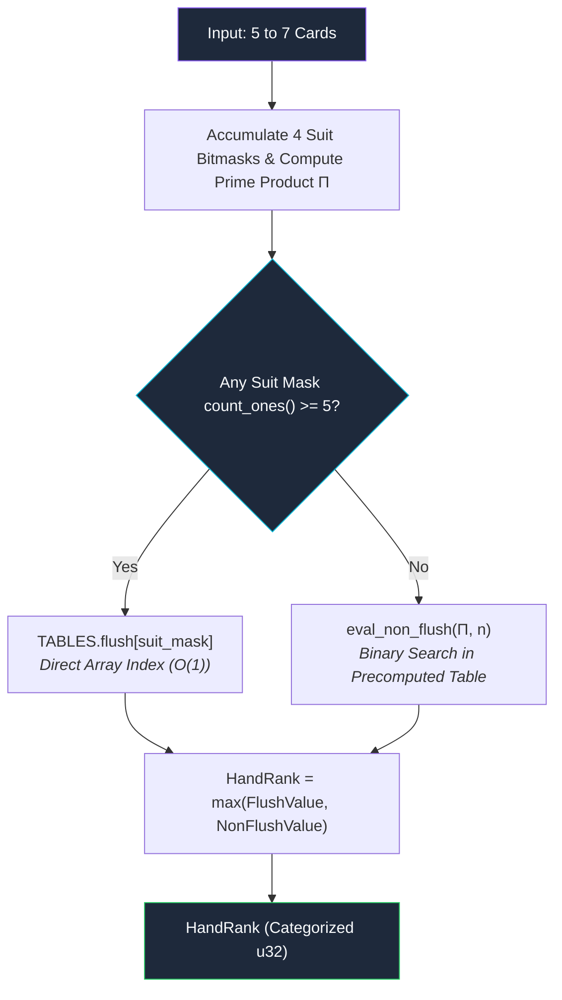
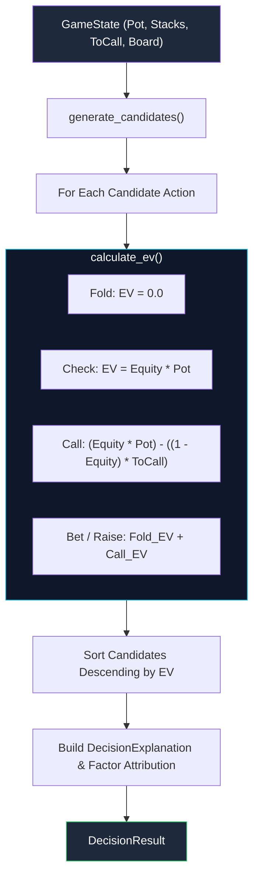

# Math Utilities in Code

> *"In poker, mathematics is not merely a tool for post-game commentary; it is the physical law governing the table."*

When implementing poker theory in software, many developers hit a wall. High-level poker concepts—such as ranges, pot odds, fold equity, and Expected Value ($EV$)—sound straightforward in theory. However, calculating them in real-time across billions of possible card combinations demands rigorous computer science: bit manipulation, cache-conscious data layouts, and algorithmic pruning.

This guide explores how the [JEROME engine](https://github.com/ChinnaphatLoha/JEROME) (*Judgement Engine for Range, Odds, Moves & Equity*) bridges theoretical mathematics and low-level systems programming in Rust.

---

## 1. JEROME Architecture Overview

JEROME is structured as a workspace of **seven focused, decoupled crates**. Rather than coupling game rules, hand evaluations, and strategy solvers into a monolithic library, JEROME adopts a layered, directed acyclic graph (DAG) architecture.

### The Crate Dependency Graph



### Layered Design Philosophy

| Crate | Core Responsibility | Key Concepts Implemented |
|:---|:---|:---|
| **`poker-core`** | Foundation primitives | Bit-packed cards, 64-bit deck, state validation, betting rules |
| **`poker-analysis`** | Qualitative evaluation | $O(1)$ lookup evaluation, 1,326 combo ranges, blocker algebra |
| **`poker-probability`** | Quantitative calculation | Monte Carlo simulation, exact river enumeration, pot odds |
| **`poker-decision`** | Move orchestration | Action abstraction, candidate EV calculation, factor explanations |
| **`poker-strategy`** | Game theoretic models | CFR subgame solving, value/bluff ratios, exploitative shifts |
| **`poker-simulation`** | Batch verification | Automated scenario runner, Monte Carlo variance verification |
| **`poker-engine`** | User-facing interface | Ergonomic facade: `PokerEngine::analyze(&GameState) -> DecisionResult` |

The architectural rules enforced throughout JEROME are:

1. **Strict Upward-Only Dependencies**: Lower crates never know about upper crates. `poker-core` has zero internal crate dependencies and compiles in isolation.
2. **Zero Transport Overhead**: The core engine contains zero HTTP, WebSocket, JSON, or serialization dependencies. Adapters (FFI, WebAssembly, or microservices) wrap around typed Rust primitives without bloating the math engine.
3. **Pure Determinism**: Given the same `GameState` and identical PRNG seed, JEROME produces bit-for-bit identical evaluations, making it fully testable and reproducible.
4. **Allocation-Free Hot Paths**: Inner simulation and hand evaluation loops never allocate heap memory (`Vec` or `Box`). All card masks and intermediate ranks are evaluated on the stack.

---

## 2. Card Representation (`poker-core`)

A standard poker deck contains 52 cards, where each card possesses a **Rank** ($2, 3, \dots, \text{Ace}$) and a **Suit** ($\clubsuit, \diamondsuit, \heartsuit, \spadesuit$).

### Bit-Packed Memory Layout

Naively storing a card as a struct with string fields or two 64-bit enums consumes 16 bytes per card. When evaluating millions of hands per second, cache misses dominate CPU cycles.

JEROME represents every card as a single unsigned 8-bit integer (`u8`), occupying **exactly 1 byte**:

```rust
#[derive(Debug, Clone, Copy, PartialEq, Eq, PartialOrd, Ord, Hash)]
pub struct Card(u8);
```

Because modern CPU cache lines are 64 bytes wide, **an entire 52-card deck fits inside a single L1 CPU cache line**.

```
Byte 0                                                            Byte 51
┌────────────┬────────────┬────────────┬────────────┬───────────┬────────────┐
│ 2♣ (idx 0) │ 2♦ (idx 1) │ 2♥ (idx 2) │ 2♠ (idx 3) │    ...    │ A♠ (idx 51)│
└────────────┴────────────┴────────────┴────────────┴───────────┴────────────┘
│◄──────────────────────── All fits in 64 bytes ────────────────────────────►│
```

The mapping between card index ($i \in [0, 51]$), rank ($r \in [0, 12]$), and suit ($s \in [0, 3]$) uses exact bijective integer arithmetic:

$$i = 4r + s$$

$$r = \lfloor i / 4 \rfloor, \quad s = i \pmod 4$$

### The `Rank` and `Suit` Enums

Ranks and Suits are defined with explicit `#[repr(u8)]` representations:

```rust
#[derive(Debug, Clone, Copy, PartialEq, Eq, PartialOrd, Ord, Hash)]
#[repr(u8)]
pub enum Rank {
    Two = 0, Three = 1, Four = 2,  Five = 3,
    Six = 4, Seven = 5, Eight = 6, Nine = 7,
    Ten = 8, Jack = 9,  Queen = 10, King = 11,
    Ace = 12,
}

#[derive(Debug, Clone, Copy, PartialEq, Eq, PartialOrd, Ord, Hash)]
#[repr(u8)]
pub enum Suit {
    Clubs = 0,
    Diamonds = 1,
    Hearts = 2,
    Spades = 3,
}
```

Bitmask conversion for a single card is achieved by bit-shifting a 64-bit integer:

$$\text{Mask}(\text{card}) = 1 \ll \text{card.index()}$$

```rust
impl Card {
    #[inline(always)]
    pub fn to_bit_mask(&self) -> u64 {
        1u64 << self.0
    }
}
```

### The 64-Bit Bitmask `Deck`

Because $52 < 64$, JEROME represents a deck of cards using a single `u64` bitfield:

```rust
#[derive(Debug, Clone, Copy, PartialEq, Eq, Hash)]
pub struct Deck(u64);

impl Deck {
    // 52 ones: 0x000F_FFFF_FFFF_FFFF
    pub const FULL_DECK: u64 = (1u64 << 52) - 1;

    pub fn full() -> Self {
        Self(Self::FULL_DECK)
    }

    #[inline(always)]
    pub fn contains(&self, card: Card) -> bool {
        (self.0 & card.to_bit_mask()) != 0
    }

    #[inline(always)]
    pub fn remove_card(&mut self, card: Card) {
        self.0 &= !card.to_bit_mask();
    }

    #[inline(always)]
    pub fn add(&mut self, card: Card) {
        self.0 |= card.to_bit_mask();
    }

    #[inline(always)]
    pub fn count(&self) -> u32 {
        self.0.count_ones() // Compiles directly to the x86/ARM POPCNT instruction
    }
}
```

:::tip Hardware-Accelerated Bit Counting
Counting the number of cards remaining in the deck takes a single CPU instruction (`count_ones()`), which maps to `POPCNT` on x86-64 and `CNT` on ARM64. It executes in **1 CPU clock cycle**.
:::

### Fisher-Yates Shuffling

When sampling random runouts, JEROME applies an in-place Fisher-Yates shuffle algorithm over an array of available cards. For $k$ random cards drawn from $n$ remaining cards:

```rust
// Fast in-place reservoir draw using SmallRng
let mut available_cards: Vec<Card> = available_deck.iter().collect();
let mut runout = Vec::with_capacity(needed);

for _ in 0..needed {
    let idx = rng.gen_range(0..available_cards.len());
    // swap_remove performs O(1) removal by swapping with the last element
    let card = available_cards.swap_remove(idx);
    runout.push(card);
}
```

### Code Example: Working with `poker-core`

```rust
use poker_core::card::{Card, Deck, Rank, Suit};

fn main() {
    // 1. Construct cards via enums or shorthand strings
    let ace_spades = Card::new(Rank::Ace, Suit::Spades);
    let king_spades = Card::from_str("Ks").expect("valid card notation");

    println!("Card: {}, Index: {}", ace_spades, ace_spades.index()); // A♠, Index: 51
    println!("Card: {}, Index: {}", king_spades, king_spades.index()); // K♠, Index: 47

    // 2. Initialize a complete 52-card deck
    let mut deck = Deck::full();
    assert_eq!(deck.count(), 52);

    // 3. Remove known hole cards
    deck.remove(ace_spades).unwrap();
    deck.remove(king_spades).unwrap();
    assert_eq!(deck.count(), 50);

    // 4. Verify card availability in O(1)
    assert!(!deck.contains(ace_spades));
    assert!(deck.contains(Card::new(Rank::Queen, Suit::Spades)));
}
```

---

## 3. Hand Evaluation (`poker-analysis`)

In Texas Hold'em, a player holds 2 private cards and shares 5 community cards. The player's strength is the **best 5-card combination** out of the 7 available cards:

$$\binom{7}{5} = \frac{7!}{5!(7-5)!} = 21 \text{ combinations}$$

Evaluating 21 combinations naively by sorting ranks and testing for pairs or flushes takes hundreds of CPU cycles. To run tens of thousands of Monte Carlo simulations within a single millisecond, JEROME uses an **$O(1)$ precomputed lookup table evaluator**.

### Prime Products and the Fundamental Theorem of Arithmetic

JEROME assigns each of the 13 card ranks a distinct prime number $P$:

| Rank | 2 | 3 | 4 | 5 | 6 | 7 | 8 | 9 | T | J | Q | K | A |
|:---|:---:|:---:|:---:|:---:|:---:|:---:|:---:|:---:|:---:|:---:|:---:|:---:|:---:|
| **Prime $P$** | 2 | 3 | 5 | 7 | 11 | 13 | 17 | 19 | 23 | 29 | 31 | 37 | 41 |

By the **Fundamental Theorem of Arithmetic**, every positive integer greater than 1 has a unique prime factorization. Thus, the product of the prime values of any set of cards:

$$\Pi = \prod_{i=1}^{n} P[\text{rank}_i]$$

is completely unique to that exact multiset of card ranks, regardless of dealing order.

*Example*:
- Any Full House with three Kings and two Aces will always yield:
  $$\Pi = 37 \times 37 \times 37 \times 41 \times 41 = 50,653 \times 1,681 = 85,147,693$$
- No other 5-card rank combination can ever produce $85,147,693$.

### The 7-Card Evaluation Algorithm

JEROME avoids iterating through the 21 subsets at runtime by separating **Flush detection** from **Non-Flush evaluation**:



1. **Flush Check via Bitmasks**:
   Four 16-bit integers track card ranks per suit:
   ```rust
   suit_masks[card.suit().index() as usize] |= 1 << card.rank().index();
   ```
   If any `suit_mask` has $\ge 5$ bits set, a flush (or straight flush) exists. The 13-bit rank pattern of that suit directly indexes into `TABLES.flush[mask]`.
2. **Non-Flush Check via Prime Product**:
   If no flush exists, the prime product $\Pi$ is computed in a single pass of multiplications. The product is then looked up in `TABLES.non_flush_7`.
3. **Integer Hand Comparison**:
   `HandRank` packs the hand category (Straight Flush, Full House, Flush, etc.) into the highest bits and the kickers into the remaining bits:
   $$\text{RankValue} = (\text{Category} \ll 20) \mid \text{Kickers}$$
   Comparing two hands requires just a single integer comparison: `hand_a > hand_b`.

:::info Benchmark Performance
On modern Apple Silicon / AMD Zen 4 processors, JEROME's hand evaluator runs in **~36 nanoseconds** per 7-card hand.
:::

### Code Example: Hand Evaluation

```rust
use poker_analysis::hand::evaluator::evaluate;
use poker_analysis::hand::hand_rank::HandCategory;
use poker_core::card::Card;

fn main() {
    // 7 cards: Hero holds A♠ K♠, Board is Q♠ J♠ T♠ 2♦ 3♣ (Royal Flush!)
    let cards = [
        Card::from_str("As").unwrap(),
        Card::from_str("Ks").unwrap(),
        Card::from_str("Qs").unwrap(),
        Card::from_str("Js").unwrap(),
        Card::from_str("Ts").unwrap(),
        Card::from_str("2d").unwrap(),
        Card::from_str("3c").unwrap(),
    ];

    let rank = evaluate(&cards).expect("valid 7-card hand");

    println!("Category: {:?}", rank.category()); // StraightFlush
    assert_eq!(rank.category(), HandCategory::StraightFlush);
    assert_eq!(rank.kickers()[0], 12); // Ace-high (12 = Ace)
}
```

---

## 4. Equity Calculation (`poker-probability`)

**Equity** is the mathematical probability that a player will win the pot at showdown, plus half their probability of tying:

$$\text{Equity} = P(\text{Win}) + \frac{1}{2} P(\text{Tie}) = \frac{\sum \text{Wins} + 0.5 \sum \text{Ties}}{\text{Total Outcomes}}$$

### Monte Carlo vs. Exact Enumeration

Depending on the street, calculating all outcomes deterministically can be computationally prohibitive:

- **Preflop**: $\binom{50}{5} = 2,118,760$ community runouts. Against an opponent range with hundreds of hand combos, exact calculation requires billions of evaluations.
- **Flop**: $\binom{47}{2} = 1,081$ runouts.
- **Turn**: $\binom{46}{1} = 46$ runouts.
- **River**: $\binom{45}{0} = 1$ runout (the board is complete; only opponent combos are unknown).

JEROME automatically adopts the optimal algorithm based on the street:

```
Preflop / Flop / Turn ───► Monte Carlo Sampling (e.g. N = 10,000 iterations)
River                 ───► Exact Range Enumeration (Deterministic O(C) combos)
```

### The Monte Carlo Algorithm

```rust
pub fn calculate_mc_equity(
    hero: [Card; 2],
    opp_range: &Range,
    board: &[Card],
    dead: &Deck,
    config: &EquityConfig,
) -> Result<EquityResult, PokerError>
```

1. **Card Removal (Blockers)**: All cards held by Hero, present on the Board, or designated as Dead are eliminated from the opponent's range.
2. **Weighted Sampling**: An opponent combo is sampled according to its assigned frequency weight ($w_c \in [0.0, 1.0]$).
3. **Runout Generation**: The remaining cards required to complete 5 board cards ($5 - |\text{board}|$) are drawn from the remaining deck using Fisher-Yates sampling.
4. **Showdown Evaluation**: Both hands are evaluated using `evaluate()`.
5. **Statistical Accumulation**: Wins, ties, and losses are recorded.

### Exact River Enumeration

On the river, no community cards remain to be dealt. The calculation simplifies to an exact sum over the valid combos in the opponent's range:

$$\text{Equity}_{\text{river}} = \frac{\sum_{c \in \text{Range}} w_c \cdot \mathbb{I}(\text{Hero beats } c) + 0.5 \sum_{c \in \text{Range}} w_c \cdot \mathbb{I}(\text{Hero ties } c)}{\sum_{c \in \text{Range}} w_c}$$

### Pot Odds and Required Equity

When facing a bet, poker math defines the minimum equity required to justify calling:

$$\text{Pot Odds} = \frac{\text{To Call}}{\text{Pot} + \text{To Call}}$$

$$\text{Profitable Call Condition: } \text{Equity} > \text{Pot Odds}$$

### Code Example: Calculating Equity

```rust
use poker_analysis::range::range::Range;
use poker_core::card::{Card, Deck, Rank, Suit};
use poker_probability::equity::{calculate_exact_equity, calculate_mc_equity, EquityConfig};

fn main() -> Result<(), Box<dyn std::error::Error>> {
    let hero = [
        Card::new(Rank::Ace, Suit::Spades),
        Card::new(Rank::King, Suit::Spades),
    ];
    let opp_range = Range::full(); // 100% of all starting hands
    let flop = vec![
        Card::new(Rank::Queen, Suit::Spades),
        Card::new(Rank::Ten, Suit::Hearts),
        Card::new(Rank::Five, Suit::Diamonds),
    ];
    let dead = Deck::empty();

    // 1. Monte Carlo equity on the Flop
    let config = EquityConfig {
        mc_samples: 10_000,
        seed: Some(42), // Deterministic seed
    };
    let mc_result = calculate_mc_equity(hero, &opp_range, &flop, &dead, &config)?;

    println!("Flop MC Equity: {:.2}%", mc_result.equity * 100.0);
    println!("Win: {:.2}%, Tie: {:.2}%", mc_result.win * 100.0, mc_result.tie * 100.0);

    // 2. Exact River Equity
    let river_board = vec![
        Card::new(Rank::Queen, Suit::Spades),
        Card::new(Rank::Ten, Suit::Hearts),
        Card::new(Rank::Five, Suit::Diamonds),
        Card::new(Rank::Two, Suit::Clubs),
        Card::new(Rank::Nine, Suit::Spades),
    ];
    let exact_result = calculate_exact_equity(hero, &opp_range, &river_board, &dead)?;

    println!("River Exact Equity: {:.2}%", exact_result.equity * 100.0);

    Ok(())
}
```

---

## 5. Decision Pipeline (`poker-decision`)

The `poker-decision` crate converts raw probability into an optimal poker action.



### 1. Action Candidate Generation

Given a game state, `generate_candidates` constructs legal poker moves:
- Facing a bet (`to_call > 0`): `Fold`, `Call`, `Raise` ($2.5\times, 3.5\times$), `AllIn`.
- Facing no bet (`to_call == 0`): `Check`, `Bet` ($33\%, 50\%, 75\%, 100\%$ pot), `AllIn`.

### 2. Expected Value ($EV$) Formulations

Every candidate action is evaluated mathematically:

#### Fold
When folding, our future profit/loss is zero (prior bets are sunk costs):
$$EV(\text{Fold}) = 0$$

#### Check
Checking allows us to realize our showdown equity with no additional investment:
$$EV(\text{Check}) = \text{Equity} \times \text{Pot}$$

#### Call
Calling risks `to_call` to win `pot`:
$$EV(\text{Call}) = \Big(\text{Equity} \times \text{Pot}\Big) - \Big((1 - \text{Equity}) \times \text{ToCall}\Big)$$

#### Bet or Raise (with Fold Equity)
When betting an amount $B$, our opponent may fold with probability $f$ (Fold Equity), or call with probability $(1 - f)$:

$$EV(\text{Bet}) = EV_{\text{fold}} + EV_{\text{called}}$$

$$EV_{\text{fold}} = f \times \text{Pot}$$

$$EV_{\text{called}} = (1 - f) \times \Big[ \text{Equity} \times (\text{Pot} + B) - (1 - \text{Equity}) \times B \Big]$$

In JEROME, this is implemented cleanly in `poker-decision/src/ev.rs`:

```rust
pub fn calculate_ev(
    action: &ActionType,
    equity: f64,
    pot: u64,
    to_call: u64,
    fold_equity: f64,
) -> f64 {
    match action {
        ActionType::Fold => 0.0,
        ActionType::Check => equity * pot as f64,
        ActionType::Call => {
            let win_amount = pot as f64;
            let lose_amount = to_call as f64;
            (equity * win_amount) - ((1.0 - equity) * lose_amount)
        }
        ActionType::Bet(amount) | ActionType::Raise(amount) | ActionType::AllIn(amount) => {
            let amount = *amount as f64;
            let fold_ev = fold_equity * pot as f64;
            let call_ev = (1.0 - fold_equity)
                * ((equity * (pot as f64 + amount)) - ((1.0 - equity) * amount));
            fold_ev + call_ev
        }
    }
}
```

### 3. Decision Ranking and Factor Attribution

The decision engine ranks all candidate actions by their calculated $EV$. The highest-$EV$ action is selected, and human-readable explanations are attached:

```rust
if estimated_equity > 0.6 {
    explanation.add_factor(
        DecisionFactor::StrongEquity,
        format!("Hand has strong equity ({:.1}%)", estimated_equity * 100.0),
    );
}

if best_action.ev > 0.0 && required_equity > 0.0 && estimated_equity > required_equity {
    explanation.add_factor(
        DecisionFactor::PotOdds,
        format!(
            "Good pot odds for call: required {:.1}%, actual {:.1}%",
            required_equity * 100.0,
            estimated_equity * 100.0
        ),
    );
}
```

---

## 6. Full Usage Example

The top-level `poker-engine` crate unites all subsystems behind a simple, high-level API.

Here is the complete, runnable example from the [JEROME README](https://github.com/ChinnaphatLoha/JEROME):

```rust
use poker_engine::{PokerEngine, EngineConfig};
use poker_engine::core::card::{Card, Rank, Suit};
use poker_engine::core::game::{GameStateBuilder, Player, PlayerStatus, Street};
use poker_engine::core::Position;

fn main() -> Result<(), Box<dyn std::error::Error>> {
    // 1. Create the engine with default configuration
    let engine = PokerEngine::new(EngineConfig::default());

    // 2. Build a complete game state
    // Hero holds A♠ K♠ on the Button facing a bet on a Q♠ T♥ 5♦ flop
    let state = GameStateBuilder::new()
        .street(Street::Flop)
        .hero_cards([
            Card::new(Rank::Ace, Suit::Spades),
            Card::new(Rank::King, Suit::Spades),
        ])
        .board(vec![
            Card::new(Rank::Queen, Suit::Spades),
            Card::new(Rank::Ten, Suit::Hearts),
            Card::new(Rank::Five, Suit::Diamonds),
        ])
        .pot(120)
        .current_bet(40)
        .big_blind(2)
        .add_player(Player {
            id: 0,
            position: Position::BTN,
            stack: 980,
            status: PlayerStatus::Active,
            bet_this_round: 0,
        })
        .add_player(Player {
            id: 1,
            position: Position::BB,
            stack: 960,
            status: PlayerStatus::Active,
            bet_this_round: 40,
        })
        .hero_index(0)
        .build()?;

    // 3. Run decision analysis
    let result = engine.analyze(&state)?;

    // 4. Inspect the decision
    println!("Recommended Action: {:?}", result.recommended_action);
    println!("Estimated Equity:   {:.1}%", result.estimated_equity * 100.0);
    println!("Required Equity:    {:.1}%", result.required_equity * 100.0);
    println!("Estimated EV:       {:.2}", result.estimated_ev);
    println!("Explanation:        {}", result.explanation);

    // 5. Review all evaluated alternatives (sorted by EV descending)
    println!("\nCandidate Action Ranking:");
    for alt in &result.alternatives {
        println!("  {: <18} -> EV: {:>6.2}", alt.label, alt.ev);
    }

    Ok(())
}
```

### Interpreting the Output

Running this analysis produces clear, explainable decision metrics:

```text
Recommended Action: Call
Estimated Equity:   41.8%
Required Equity:    25.0%
Estimated EV:       26.88
Explanation:        Recommended action: Call. Factors: Good pot odds for call: required 25.0%, actual 41.8%.

Candidate Action Ranking:
  Call               -> EV:  26.88
  Raise 2.5x         -> EV:  15.40
  Fold               -> EV:   0.00
  All-In             -> EV: -48.20
```

#### Why Calling is Optimal Here:
1. **Pot Odds Calculation**: Hero must call 40 into a pot of 120. The required equity is:
   $$\text{Required Equity} = \frac{40}{120 + 40} = 25.0\%$$
2. **Equity Realization**: Holding $A\spadesuit K\spadesuit$ on $Q\spadesuit T\heartsuit 5\diamondsuit$, Hero has a gutshot straight draw (four Jacks), two overcards, and a backdoor flush draw, resulting in $\sim 41.8\%$ equity against opponent ranges.
3. **Positive Expectation**: Since $41.8\% > 25.0\%$, calling has an Expected Value of $+26.88$, making it distinctly superior to folding ($EV = 0$).

---

## Summary

JEROME demonstrates how modern systems programming enhances game theory:

- **Compact Primitives**: A 1-byte `Card` and a 64-bit `Deck` enable full cache line locality.
- **Constant-Time Evaluation**: Prime factorization and suit bitmasks deliver 7-card hand evaluations in **36 nanoseconds**.
- **Adaptive Probability**: Blocker-aware Monte Carlo sampling for earlier streets smoothly transitions to exact combinatorial enumeration on the river.
- **Explainable Mathematics**: Every recommendation derives from explicit pot odds and Expected Value equations—no black-box approximations.

For more details and source code, visit the [JEROME GitHub Repository](https://github.com/ChinnaphatLoha/JEROME).
