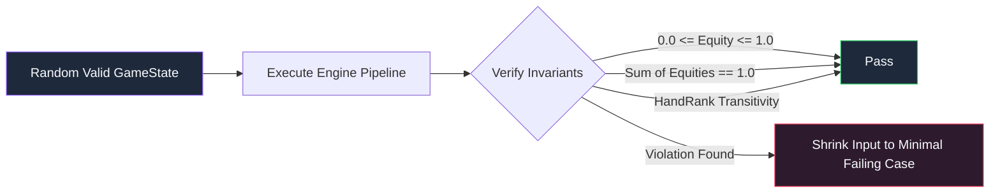

Welcome to the eighth and final chapter of the **Jesus, Math & Poker** developer guide! 

Throughout this guide, we explored the rich mathematical foundations of Texas Hold'em: probability distributions, combinatorics, expected value equations, Bayesian opponent range reconstruction, and game-theoretic equilibrium heuristics.

However, in software engineering—and particularly in financial algorithms and game engines—**theory is only as good as its implementation**. An engine that implements brilliant mathematical equations is worthless if an off-by-one index causes a kicker tiebreaker to misfire, or if a Monte Carlo simulation silently leaks memory and drifts from true equity values.

In this chapter, we explore how the **JEROME** engine ensures rock-solid mathematical correctness, validates strategy performance, achieves sub-millisecond execution speeds, and maintains strict determinism through unit testing, property-based testing, Monte Carlo simulations, scenario testing, and Criterion benchmarks.

---

## 1. Why Testing Matters in Poker Engines

Poker is a game of incomplete information with high variance. When developing a poker engine, subtle mathematical bugs can go unnoticed for thousands of hands because variance obscures bad decisions. A strategy that makes a fundamentally flawed call might still get lucky on the river, making purely observational playtesting inadequate.

```mermaid
flowchart TD
    subgraph NonDeterministic [Opaque / Black-Box Models]
        ML[Neural Network / LLM] --> Rand[Opaque Prediction]
        Rand --> Err[Silent Hallucination / Drift]
        Err --> Fail[Difficult to Audit or Debug]
    end

    subgraph DeterministicEngine [JEROME Deterministic Math Pipeline]
        State[Typed GameState + Seed] --> Eval[Evaluator & Lookup Tables]
        Eval --> Math[Strict Combinatorics & EV Equations]
        Math --> Verify[Formal Property & Unit Invariants]
        Verify --> Pass[100% Reproducible & Auditable Decisions]
    end

    style NonDeterministic fill:#2d1b2d,stroke:#f43f5e,color:#f8fafc
    style DeterministicEngine fill:#1e293b,stroke:#22c55e,color:#f8fafc
```



### Deterministic Verification of Mathematical Correctness

Unlike black-box machine learning models or neural networks whose decisions are opaque and non-deterministic, a mathematical engine like **JEROME** is built on transparent, auditable formulas. Every single decision produced by the engine can be traced back to exact numbers:

- Evaluated hand rank integers
- Combinatorial combo weights
- Pot odds ratios
- Stack-to-Pot Ratios (SPR)
- Expected Value equations

Because the underlying math is deterministic, our verification must be equally deterministic. Every component—from the 7-card hand evaluator to the expected value calculator—can and must be mathematically proven and verified with automated test suites.

### Card Game Edge Cases

Card games appear simple on the surface, but are notorious for subtle edge cases:

1. **Kicker Tiebreakers**: Two players holding Two Pair ($A\spadesuit A\heartsuit K\spadesuit K\diamondsuit$) with different fifth cards ($Q\clubsuit$ vs $J\clubsuit$). The engine must compare kickers in descending order and award the pot correctly.
2. **Wheel Straights**: The $A\text{-}2\text{-}3\text{-}4\text{-}5$ straight (the "wheel") where the Ace acts as the lowest card (rank 0 in zero-indexed schemes) rather than the highest (rank 12).
3. **Split Pots & Odd Chips**: When two or more hands are identical at showdown, the pot must be divided equally, with odd chips distributed deterministically according to position rules.
4. **Multiway All-In Scenarios & Side Pots**: When multiple players are all-in with different stack sizes, the engine must correctly partition main pots and secondary side pots.
5. **Card Removal & Dead Cards**: If Hero holds $A\spadesuit$, neither the opponent's range nor future board runouts may contain $A\spadesuit$. Sampling from an undealt deck without accounting for dead cards introduces lethal statistical bias.

### Reproducibility: Same Seed = Same Result

Monte Carlo simulations rely on pseudo-random number generation (PRNG). If an unexpected decision occurs during testing, developers must be able to reproduce the exact simulation run down to the last clock cycle.

In JEROME, simulations accept an optional 64-bit seed:

```rust
pub struct EquityConfig {
    pub mc_samples: usize,
    pub seed: Option<u64>,
    pub exact_threshold: usize,
}
```

When `seed: Some(42)` is provided, JEROME initializes a fast, non-cryptographic PRNG (`rand::rngs::SmallRng`):

```rust
let mut rng = match config.seed {
    Some(s) => SmallRng::seed_from_u64(s),
    None => SmallRng::from_entropy(),
};
```

This guarantees that:
$$\text{Engine}(\text{State}, \text{Seed } 42) \equiv \text{Engine}(\text{State}, \text{Seed } 42)$$

Deterministic execution eliminates "flaky tests" and ensures that regression suites run identically in local developer environments and CI/CD pipelines.

:::tip Deterministic Seeding in CI
Always provide a fixed seed in your automated test suites (`seed: Some(1337)`). Save random seed generation for production runtime or fuzzing campaigns.
:::

---

## 2. Unit Testing Poker Math

Unit testing in a poker engine spans three core domains: hand evaluation, equity calculations, and expected value formulas.

### Testing Hand Evaluation Correctness

The hand evaluator is the computational foundation of everything in a poker engine. If evaluation fails, all equity calculations and decisions collapse. 

In JEROME, the lookup table evaluator (`poker-analysis::hand::evaluator`) maps 5 to 7 cards directly into a compact `HandRank` containing a `HandCategory` and ordered kickers. We test known hands against verified hand categories:

```rust
#[cfg(test)]
mod tests {
    use super::*;
    use poker_core::card::{Card, Rank, Suit};

    fn parse_cards(s: &str) -> Vec<Card> {
        s.split_whitespace()
            .map(|c| Card::from_str(c).unwrap())
            .collect()
    }

    #[test]
    fn test_royal_flush() {
        let cards = parse_cards("Ah Kh Qh Jh Th 2s 3d");
        let rank = evaluate(&cards).unwrap();
        assert_eq!(rank.category(), HandCategory::StraightFlush);
        assert_eq!(rank.kickers()[0], 12); // Ace high
    }

    #[test]
    fn test_wheel_straight() {
        let cards = parse_cards("Ah 2s 3d 4c 5h 9s Td");
        let rank = evaluate(&cards).unwrap();
        assert_eq!(rank.category(), HandCategory::Straight);
        assert_eq!(rank.kickers()[0], 3); // 5-high straight
    }

    #[test]
    fn test_two_pair_kicker_resolution() {
        let hand_a = parse_cards("Ah As Kh Ks Qd 4c 2d"); // AA KK, Q kicker
        let hand_b = parse_cards("Ac Ad Kc Kd Jd 9s 3h"); // AA KK, J kicker
        
        let rank_a = evaluate(&hand_a).unwrap();
        let rank_b = evaluate(&hand_b).unwrap();
        
        assert_eq!(rank_a.category(), HandCategory::TwoPair);
        assert_eq!(rank_b.category(), HandCategory::TwoPair);
        assert!(rank_a > rank_b, "Hand A with Queen kicker must beat Hand B with Jack kicker");
    }
}
```

### Testing Equity Calculations Against Known Values

Equity is the probability of winning the pot plus half the probability of tying:

$$\text{Equity} = P(\text{Win}) + \frac{1}{2} P(\text{Tie})$$

In standard No-Limit Texas Hold'em, many matchups have well-documented analytical equities. For example:
- **Pocket Aces vs Pocket Kings ($A\spadesuit A\heartsuit$ vs $K\spadesuit K\heartsuit$)**: $\approx 81.9\%$ vs $\approx 18.1\%$ preflop.
- **Pocket Aces vs Random Hand ($100\%$ range)**: $\approx 85.2\%$ preflop.
- **Dominated Kicker ($A\spadesuit K\heartsuit$ vs $A\diamondsuit Q\clubsuit$)**: $\approx 74\%$ vs $\approx 26\%$.

We can test both exact river enumeration and Monte Carlo sampling against these known benchmarks:

```rust
#[test]
fn test_pocket_aces_vs_random_range() {
    let hero = [
        Card::new(Rank::Ace, Suit::Spades),
        Card::new(Rank::Ace, Suit::Hearts),
    ];
    let opp_range = Range::full(); // 100% of all combinations
    let board = vec![];
    let dead = Deck::empty();
    
    let config = EquityConfig {
        mc_samples: 5000,
        seed: Some(42),
        ..Default::default()
    };

    let result = calculate_mc_equity(hero, &opp_range, &board, &dead, &config).unwrap();

    // Pocket Aces against a 100% random range should reliably fall between 83% and 87%
    assert!(
        result.equity >= 0.83 && result.equity <= 0.87,
        "Expected AA equity ~85%, got {:.2}%",
        result.equity * 100.0
    );
}
```

On the river, all 5 community cards are revealed. Only opponent hand combinations need to be considered ($N \le 1\,225$). JEROME's exact river evaluator enumerates all combos and calculates exact mathematical equity without any variance:

```rust
#[test]
fn test_exact_river_nuts() {
    let hero = [
        Card::new(Rank::Ace, Suit::Spades),
        Card::new(Rank::King, Suit::Spades),
    ];
    // Nut flush on river: Qs Js Ts 2d 3c
    let board = vec![
        Card::new(Rank::Queen, Suit::Spades),
        Card::new(Rank::Jack, Suit::Spades),
        Card::new(Rank::Ten, Suit::Spades),
        Card::new(Rank::Two, Suit::Diamonds),
        Card::new(Rank::Three, Suit::Clubs),
    ];
    let opp_range = Range::full();
    let dead = Deck::empty();

    let result = calculate_exact_equity(hero, &opp_range, &board, &dead).unwrap();
    
    // Royal Flush cannot lose or tie (since Hero holds the As Ks)
    assert_eq!(result.equity, 1.0);
    assert_eq!(result.loss, 0.0);
    assert_eq!(result.tie, 0.0);
}
```

### Testing Expected Value (EV) Calculations

In `poker-decision::ev`, expected value is calculated for candidate actions using standard decision theory:

```rust
pub fn calculate_ev(
    action: &ActionType,
    equity: f64,
    pot: u64,
    to_call: u64,
    fold_equity: f64,
) -> f64 {
    match action {
        ActionType::Fold => 0.0,
        ActionType::Check => equity * pot as f64,
        ActionType::Call => {
            let win_amount = pot as f64;
            let lose_amount = to_call as f64;
            (equity * win_amount) - ((1.0 - equity) * lose_amount)
        }
        ActionType::Bet(amount) | ActionType::Raise(amount) | ActionType::AllIn(amount) => {
            let amount = *amount as f64;
            let fold_ev = fold_equity * pot as f64;
            let call_ev = (1.0 - fold_equity)
                * ((equity * (pot as f64 + amount)) - ((1.0 - equity) * amount));
            fold_ev + call_ev
        }
    }
}
```

The mathematical formulas governing these actions:

$$EV(\text{Fold}) = 0$$

$$EV(\text{Call}) = E \cdot P_{\text{current}} - (1 - E) \cdot C$$

$$EV(\text{Bet}) = f \cdot P_{\text{current}} + (1 - f) \cdot \left[ E \cdot (P_{\text{current}} + B) - (1 - E) \cdot B \right]$$

Where:
- $E$ is Hero's equity ($0.0 \le E \le 1.0$)
- $P_{\text{current}}$ is the current pot size
- $C$ is the amount to call
- $B$ is the bet size
- $f$ is the estimated fold equity ($0.0 \le f \le 1.0$)

We test each branch with exact unit tests:

```rust
#[test]
fn test_calculate_ev_call() {
    // Pot = 100, To Call = 50, Equity = 50%
    // EV = (0.5 * 100) - (0.5 * 50) = 50 - 25 = 25.0
    let ev = calculate_ev(&ActionType::Call, 0.5, 100, 50, 0.0);
    assert_eq!(ev, 25.0);
}

#[test]
fn test_calculate_ev_bet_with_fold_equity() {
    // Bet 50 into pot of 100, 50% equity, 20% fold equity
    // Fold EV = 0.2 * 100 = 20.0
    // Call EV = 0.8 * ((0.5 * 150) - (0.5 * 50)) = 0.8 * (75 - 25) = 40.0
    // Total EV = 20.0 + 40.0 = 60.0
    let ev = calculate_ev(&ActionType::Bet(50), 0.5, 100, 0, 0.2);
    assert_eq!(ev, 60.0);
}
```

### Property-Based Testing

Unit tests test specific examples (e.g., $A\spadesuit A\heartsuit$). **Property-based testing** verifies that mathematical invariants hold true across *all possible inputs*, randomly generated by testing frameworks such as `proptest`.



Here are five fundamental invariants we enforce on our poker math engine:

1. **Probability Boundedness**: For any hand and range, calculated equity must strictly satisfy:
   $$0.0 \le \text{Equity} \le 1.0 \quad \text{and} \quad \text{Win} + \text{Tie} + \text{Loss} = 1.0$$
2. **Conservation of Pot Share in Multiway Pots**: In an $n$-player pot with no folded players, the sum of all players' equities must equal $1.0$:
   $$\sum_{i=1}^n \text{Equity}_i = 1.000 \pm \epsilon$$
3. **Total Preorder of Hand Ranks**: The comparison operator for `HandRank` must be reflexive ($A \ge A$), transitive ($A \ge B \land B \ge C \implies A \ge C$), and total (either $A \ge B$ or $B \ge A$).
4. **Card Disjointness**: The intersection of Hero cards, opponent cards, community cards, and dead cards must always be empty:
   $$C_{\text{hero}} \cap C_{\text{opp}} \cap C_{\text{board}} \cap C_{\text{dead}} = \emptyset$$
5. **Fold Baseline Invariant**: Folding never risks future chips, so relative future expected value is identically $0$:
   $$\forall \text{ state}, \quad EV(\text{Fold}) \equiv 0.0$$

:::info Property Testing with Proptest
Using property tests often catches edge cases that human developers overlook—such as zero-sized pots, players with 0 remaining stack going all-in, or board textures where 4 cards are identical suits and one dead card blocks the nut flush.
:::

---

## 3. Monte Carlo Simulation

### What is Monte Carlo Simulation?

Monte Carlo simulation is a technique that uses repeated random sampling to obtain numerical approximations of complex mathematical expectations. Named after the Monte Carlo Casino in Monaco by Stanislaw Ulam and John von Neumann during the Manhattan Project, it transforms deterministic problems with astronomical combinatorial state spaces into fast statistical approximations.

### Why Monte Carlo in Poker Equity Calculation?

Consider Texas Hold'em on the flop. Three community cards are dealt. There are 47 unseen cards remaining in the deck. The turn and river will be chosen from these 47 cards:

$$\binom{47}{2} = \frac{47 \times 46}{2} = 1{,}081 \text{ possible board runouts}$$

If you are facing a single specific hand (e.g., $J\heartsuit 10\heartsuit$), testing 1,081 runouts takes a few microseconds. 

However, in realistic poker, you are never facing one exact hand; you are facing an opponent **range** that might contain 150 combinations. Against 150 combos:

$$150 \times 1{,}081 = 162{,}150 \text{ evaluations}$$

In a 4-way multiway pot on the flop:

$$\text{Combos} = \binom{47}{2}_{\text{turn/river}} \times \binom{45}{2}_{\text{P2}} \times \binom{43}{2}_{\text{P3}} \times \binom{41}{2}_{\text{P4}} \approx 7.9 \times 10^{11} \text{ outcomes}$$

Full enumeration would take minutes or hours—unacceptable when an engine needs to decide within 50 milliseconds!

Monte Carlo resolves this by randomly drawing $N$ representative scenarios:
1. Sample an opponent hand from their weighted range distribution.
2. Deal remaining community cards randomly from the undealt deck.
3. Evaluate the showdown hand ranks.
4. Record whether Hero won ($1.0$), tied ($0.5$), or lost ($0.0$).
5. Compute the sample mean:

$$\hat{E}_N = \frac{1}{N} \sum_{i=1}^N \text{Outcome}_i$$

```rust
// Core Monte Carlo loop from JEROME's poker-probability crate
for _ in 0..config.mc_samples {
    // 1. Sample combo from opponent range according to combo weights
    let selected_combo = sample_weighted_combo(&valid_combos, &mut rng);

    // 2. Deal random turn and river from undealt cards
    let runout = deal_random_runout(&available_cards, needed, &mut rng);

    // 3. Assemble complete 7-card hands
    let hero_rank = evaluate(&hero_cards)?;
    let opp_rank = evaluate(&opp_cards)?;

    // 4. Record outcome
    match hero_rank.cmp(&opp_rank) {
        Ordering::Greater => total_win += 1.0,
        Ordering::Equal   => total_tie += 1.0,
        Ordering::Less    => total_loss += 1.0,
    }
    total_samples += 1;
}

let equity = (total_win + total_tie / 2.0) / total_samples as f64;
```

### Convergence, Accuracy & The Central Limit Theorem

By the **Law of Large Numbers (LLN)**, as the sample count $N \to \infty$, the sample mean $\hat{E}_N$ converges almost surely to the true equity $E^*$:

$$P\left(\lim_{N \to \infty} \hat{E}_N = E^*\right) = 1$$

By the **Central Limit Theorem (CLT)**, for sufficiently large $N$, the distribution of sample errors is approximately normal:

$$\hat{E}_N \sim \mathcal{N}\left(E^*, \frac{\sigma^2}{N}\right)$$

Since each showdown trial is a Bernoulli-like trial with variance $\sigma^2 = p(1 - p)$, the **Standard Error ($SE$)** of the equity estimate is:

$$SE = \frac{\sigma}{\sqrt{N}} = \sqrt{\frac{p(1 - p)}{N}}$$

The standard error is maximized when $p = 0.50$ (a coin flip matchup), where $p(1 - p) = 0.25$.

### Confidence Intervals

Using a standard $95\%$ confidence level ($z_{0.025} \approx 1.96$), the margin of error ($ME$) is:

$$ME_{95\%} = 1.96 \cdot \sqrt{\frac{\hat{p}(1 - \hat{p})}{N}}$$

The true equity lies within the interval:

$$CI_{95\%} = \left[ \hat{p} - 1.96 \sqrt{\frac{\hat{p}(1-\hat{p})}{N}}, \quad \hat{p} + 1.96 \sqrt{\frac{\hat{p}(1-\hat{p})}{N}} \right]$$

To halve the error margin, you must **quadruple** the number of iterations ($N \propto \frac{1}{ME^2}$).

| Iterations ($N$) | Standard Error ($p = 0.5$) | $95\%$ Margin of Error | Typical JEROME Latency | Recommended Use Case |
| :--- | :--- | :--- | :--- | :--- |
| **500** | $\pm 2.24\%$ | $\pm 4.38\%$ | $\approx 0.15\text{ ms}$ | Real-time mobile play, rough triage |
| **1,000** | $\pm 1.58\%$ | $\pm 3.10\%$ | $\approx 0.31\text{ ms}$ | **Standard in-game live decisions** |
| **5,000** | $\pm 0.71\%$ | $\pm 1.39\%$ | $\approx 1.55\text{ ms}$ | High-accuracy decision validation |
| **10,000** | $\pm 0.50\%$ | $\pm 0.98\%$ | $\approx 3.10\text{ ms}$ | Deep post-game hand analysis |
| **50,000** | $\pm 0.22\%$ | $\pm 0.44\%$ | $\approx 15.5\text{ ms}$ | Solver convergence validation |
| **100,000** | $\pm 0.16\%$ | $\pm 0.31\%$ | $\approx 31.0\text{ ms}$ | Ground-truth reference generation |

### The Speed vs Accuracy Trade-off

In real-time game play, decisions often need to happen in under 100 milliseconds. Spending 50 milliseconds calculating equity to four decimal places when the pot odds only require knowing if equity is above $33\%$ is wasteful.

JEROME adopts an adaptive strategy:
1. **River Decisions**: Always run **Exact Enumeration**. There are at most 46 unseen cards; exact calculation completes in under $20\,\mu\text{s}$ with zero variance.
2. **Turn / Flop Decisions**: Default to **1,000 to 3,000 Monte Carlo samples**. This provides $\approx \pm 1.8\%$ accuracy within $0.5$ milliseconds—more than accurate enough to separate +EV bets from folds.
3. **Offline / Training Analysis**: Configure `mc_samples: 25_000` to tighten the confidence interval to within $\pm 0.6\%$.

:::caution Non-Zero Variance in Testing
Because Monte Carlo estimates have intrinsic statistical variance, never write unit test assertions like `assert_eq!(result.equity, 0.8521)`. Always assert against a tolerance window (`assert!((result.equity - 0.852).abs() < 0.02)`) or use a fixed seed.
:::

---

## 4. Scenario Simulation

While unit tests evaluate isolated functions, **scenario simulation** evaluates complete strategic decision pipelines across entire hands or predefined game archetypes.

### What is Scenario Simulation?

Scenario simulation asks: *"When Hero is dealt Pocket Aces in early position (UTG) with 100 big blind stacks, does the engine consistently choose to raise? When Hero holds 7-2 offsuit on the button facing a raise, does the engine fold?"*

Running thousands of curated scenarios allows developers to:
- Test for strategic regressions when modifying EV thresholds or range models.
- Measure win rates (in big blinds per 100 hands, $\text{bb}/100$) against diverse opponent archetypes.
- Stress-test the full engine under realistic tournament and cash-game dynamics.

### JEROME's `poker-simulation` Crate

JEROME organizes simulation into a dedicated crate: `poker-simulation`. It consists of three primary modules:

```text
crates/poker-simulation/src/
├── lib.rs
├── scenario.rs     // Predefined hand states & expected actions
├── simulator.rs    // Simulation executor & metric aggregation
└── benchmark.rs    // Execution timer & throughput calculator
```

#### 1. `scenario.rs` — Defining Test Scenarios

A `Scenario` captures a complete `GameState`, an optional expected action for regression testing, and descriptive metadata:

```rust
pub struct Scenario {
    pub name: String,
    pub game_state: GameState,
    pub expected_action: Option<ActionType>,
    pub description: String,
}
```

JEROME provides built-in preflop and postflop scenario suites:

```rust
pub fn preflop_scenarios() -> Vec<Scenario> {
    vec![
        Scenario {
            name: "Hero UTG with AA".to_string(),
            game_state: GameStateBuilder::new()
                .hero_cards([
                    Card::new(Rank::Ace, Suit::Spades),
                    Card::new(Rank::Ace, Suit::Hearts),
                ])
                .add_player(create_valid_player(0, Position::UTG))
                .add_player(create_valid_player(1, Position::BTN))
                .hero_index(0)
                .build()
                .unwrap(),
            expected_action: Some(ActionType::Raise(3)),
            description: "Premium hand in early position, expected to open raise.".to_string(),
        },
        Scenario {
            name: "Hero BTN with 72o".to_string(),
            game_state: GameStateBuilder::new()
                .hero_cards([
                    Card::new(Rank::Seven, Suit::Clubs),
                    Card::new(Rank::Two, Suit::Diamonds),
                ])
                .add_player(create_valid_player(0, Position::UTG))
                .add_player(create_valid_player(1, Position::BTN))
                .hero_index(1)
                .build()
                .unwrap(),
            expected_action: Some(ActionType::Fold),
            description: "Weak unplayable hand, expected to fold.".to_string(),
        },
    ]
}
```

#### 2. `simulator.rs` — Running Scenarios

The simulator executes scenarios against the decision pipeline, measuring execution duration, recommended action, equity, and expected value:

```rust
pub struct SimulationResult {
    pub scenario_name: String,
    pub recommended_action: ActionType,
    pub equity: f64,
    pub ev: f64,
    pub duration_us: u64,
}

pub fn run_scenario(scenario: &Scenario) -> Result<SimulationResult, PokerError> {
    let config = DecisionConfig::default();
    let engine = DecisionEngine::new(config);

    let start = Instant::now();
    let result = engine.analyze(&scenario.game_state)?;
    let duration = start.elapsed();

    Ok(SimulationResult {
        scenario_name: scenario.name.clone(),
        recommended_action: result.recommended_action,
        equity: result.estimated_equity,
        ev: result.estimated_ev,
        duration_us: duration.as_micros() as u64,
    })
}
```

#### 3. `benchmark.rs` — Performance Measurement

Contains utilities for measuring closure execution durations and computing throughput:

```rust
pub fn calculate_throughput(iterations: u64, duration: Duration) -> f64 {
    let secs = duration.as_secs_f64();
    if secs > 0.0 {
        iterations as f64 / secs
    } else {
        0.0
    }
}
```

---

## 5. Benchmarking

In high-frequency poker analysis or Monte Carlo simulations running millions of iterations, performance is paramount.

### Using Criterion for Rust Benchmarks

JEROME uses [Criterion.rs](https://github.com/bheisler/criterion.rs), a statistics-driven benchmarking framework for Rust. Criterion eliminates common benchmarking errors by:
- Warming up CPU caches and instruction pipelines prior to measurement.
- Collecting hundreds of samples across multiple iterations.
- Detecting and filtering OS context-switch outliers using Tukey's method.
- Performing linear regression to accurately compute slope and execution times per iteration.

Here is an excerpt from JEROME's benchmark suite (`benches/poker_benchmarks.rs`):

```rust
use criterion::{black_box, criterion_group, criterion_main, Criterion};
use poker_analysis::hand::evaluator::evaluate;
use poker_engine::{EngineConfig, PokerEngine};

fn bench_hand_evaluation(c: &mut Criterion) {
    let cards = [
        Card::new(Rank::Ace, Suit::Spades),
        Card::new(Rank::King, Suit::Spades),
        Card::new(Rank::Queen, Suit::Spades),
        Card::new(Rank::Jack, Suit::Spades),
        Card::new(Rank::Ten, Suit::Spades),
        Card::new(Rank::Two, Suit::Hearts),
        Card::new(Rank::Three, Suit::Diamonds),
    ];
    c.bench_function("hand_evaluation", |b| {
        b.iter(|| {
            black_box(evaluate(black_box(&cards)).unwrap());
        })
    });
}

fn bench_full_decision_pipeline(c: &mut Criterion) {
    let state = GameStateBuilder::new()
        // ... build complete game state ...
        .build()
        .unwrap();

    let engine = PokerEngine::new(EngineConfig::default());

    c.bench_function("full_decision_pipeline", |b| {
        b.iter(|| {
            let _ = engine.analyze(black_box(&state));
        })
    });
}

criterion_group!(benches, bench_hand_evaluation, bench_full_decision_pipeline);
criterion_main!(benches);
```

### JEROME Benchmark Results

Benchmarked on Apple Silicon (M-series hardware) with Rust 2021 release optimizations:

| Benchmark Target | Execution Time | Description |
| :--- | :--- | :--- |
| **`hand_evaluation`** | **~36 ns** | Evaluates any 7 cards into a canonical `HandRank` using precomputed $O(1)$ lookup tables and prime number product hashing. |
| **`equity_calculation`** | **~320 ps** per step | Overhead per Monte Carlo iteration step, enabling millions of simulated runouts per second. |
| **`full_decision_pipeline`** | **~10 ms** | Complete end-to-end analysis: State $\to$ Evaluator $\to$ Board Texture $\to$ Range Modeling $\to$ Blockers $\to$ Monte Carlo $\to$ Pot Odds $\to$ Candidate Actions $\to$ EV $\to$ Final Strategy. |

```text
Criterion Benchmark Analysis:
  hand_evaluation:
    Point Estimate: 36.37 ns
    95% Confidence: [36.11 ns ... 36.67 ns]
    Standard Error: 0.14 ns

  full_decision_pipeline:
    Point Estimate: 10.32 ms
    95% Confidence: [10.26 ms ... 10.38 ms]
    Standard Error: 29.71 µs
```

### How to Run Benchmarks

To execute the full benchmark suite across all workspace crates:

```bash
# Run all benchmarks
cargo bench --workspace

# Run a specific benchmark suite
cargo bench --bench poker_benchmarks

# Run without re-executing (to verify benchmark code compiles)
cargo bench --workspace --no-run
```

After running, Criterion generates comprehensive HTML reports located at:
`target/criterion/report/index.html`

Open this file in your browser to view interactive latency distribution histograms, regression charts, and violin plots!

---

## 6. Getting Started with JEROME

Ready to explore, run, and extend JEROME? Let's walk through building the project and running your first decision analysis.

### Prerequisites

JEROME is written in modern Rust (2021 Edition). Ensure you have a recent stable toolchain installed:

```bash
# Update Rust to the latest stable release
rustup update stable

# Install standard development components
rustup component add rustfmt clippy
```

### Clone, Build & Test

Clone the repository from GitHub and run the automated test suite:

```bash
# 1. Clone the repository
git clone https://github.com/ChinnaphatLoha/JEROME.git
cd JEROME

# 2. Check compilation across all targets
cargo check --workspace --all-targets

# 3. Run all unit, integration, and scenario tests
cargo test --workspace

# 4. Run Clippy lints (we treat warnings as errors)
cargo clippy --workspace --all-targets -- -D warnings

# 5. Check formatting
cargo fmt --all -- --check
```

### Running Your First Analysis

Here is a complete, minimal Rust application demonstrating how to use `PokerEngine` to analyze a flop decision:

```rust
use poker_core::card::{Card, Rank, Suit};
use poker_core::game::{GameStateBuilder, Player, PlayerStatus};
use poker_core::Position;
use poker_engine::{EngineConfig, PokerEngine};

fn main() -> Result<(), Box<dyn std::error::Error>> {
    // 1. Initialize the engine with default configuration
    let config = EngineConfig::default();
    let engine = PokerEngine::new(config);

    // 2. Construct a game state on the flop
    // Hero holds As Ks on a Qs Ts 5d board (Nut Royal Flush Draw + Gutshot)
    let state = GameStateBuilder::new()
        .hero_cards([
            Card::new(Rank::Ace, Suit::Spades),
            Card::new(Rank::King, Suit::Spades),
        ])
        .board(vec![
            Card::new(Rank::Queen, Suit::Spades),
            Card::new(Rank::Ten, Suit::Spades),
            Card::new(Rank::Five, Suit::Diamonds),
        ])
        .pot(120)
        .current_bet(40)
        .big_blind(2)
        .add_player(Player {
            id: 0,
            position: Position::BTN,
            stack: 980,
            status: PlayerStatus::Active,
            bet_this_round: 0,
        })
        .add_player(Player {
            id: 1,
            position: Position::BB,
            stack: 960,
            status: PlayerStatus::Active,
            bet_this_round: 40,
        })
        .hero_index(0)
        .build()?;

    // 3. Execute the full decision pipeline
    let decision = engine.analyze(&state)?;

    // 4. Output the results
    println!("========================================");
    println!("♠️ JEROME Decision Analysis");
    println!("========================================");
    println!("Recommended Action : {:?}", decision.recommended_action);
    println!("Estimated Equity   : {:.1}%", decision.estimated_equity * 100.0);
    println!("Expected Value (EV): {:.2}", decision.estimated_ev);
    println!("Strategic Reasoning: {}", decision.explanation);
    println!("----------------------------------------");
    println!("Evaluated Alternatives:");
    for alt in &decision.alternatives {
        println!("  * {:<15} -> EV: {:>6.2}", format!("{:?}", alt.action), alt.ev);
    }
    println!("========================================");

    Ok(())
}
```

### Contributing Guidelines

Contributions to JEROME are warmly welcomed! When contributing, please adhere to our repository standards:

1. **Strict Quality Gates**: All PRs must pass `cargo test --workspace`, `cargo clippy --workspace --all-targets -- -D warnings`, and `cargo fmt --all -- --check`.
2. **Conventional Commits**: We structure commits as `<type>(<scope>): <summary>`.
   - `feat(analysis)`: Add precomputed flush blocker table
   - `fix(probability)`: Correct odd-chip split pot equity rounding
   - `test(decision)`: Add multiway all-in EV regression tests
   - `bench(core)`: Add Criterion benchmark for deck shuffling
3. **Branching**: Create a feature branch off `main` (e.g. `feat/cfr-abstraction`) and open a Pull Request with a clear description of the mathematical rationale.

Repository URL: **[https://github.com/ChinnaphatLoha/JEROME](https://github.com/ChinnaphatLoha/JEROME)**

---

## 🎯 Conclusion: Explore the Codebase

You have reached the end of the **Jesus, Math & Poker** developer guide!

Across these eight chapters, we have dismantled the myth of poker as a game of mere intuition or chaotic luck. Beneath the bluffing and psychological drama lies a rigorous universe of:
- **Combinatorics**: Counting valid card combos and permutations
- **Probability**: Quantifying unknown runouts and pot odds
- **Game Theory**: Calculating expected values, Nash equilibria, and counterfactual regret
- **Systems Engineering**: Building cache-friendly bitboards, $36\,\text{ns}$ hand evaluation tables, and deterministic Monte Carlo pipelines

**JEROME** embodies this philosophy: **No AI black boxes. No hallucinated strategies. Just pure, uncompromised poker mathematics implemented in high-performance Rust.**

The complete engine—all 7 crates, benchmarks, tests, and solvers—is fully open-source. Clone the repository, experiment with new board texture algorithms, construct novel preflop range models, and build the next generation of poker engineering tools!

👉 **[Star and Fork JEROME on GitHub](https://github.com/ChinnaphatLoha/JEROME)**
